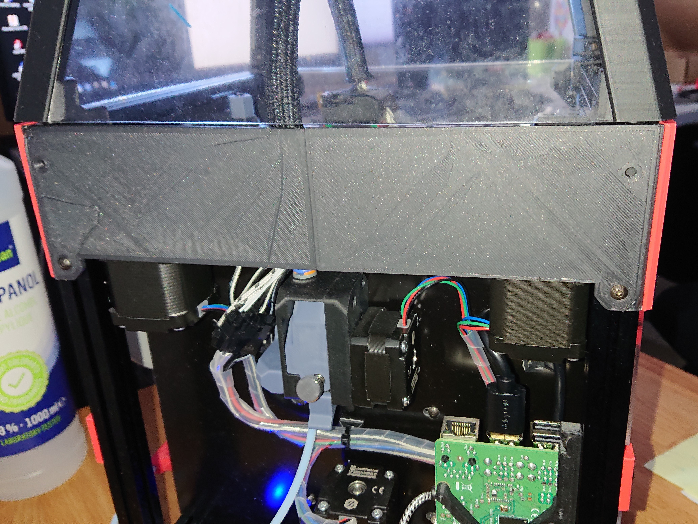
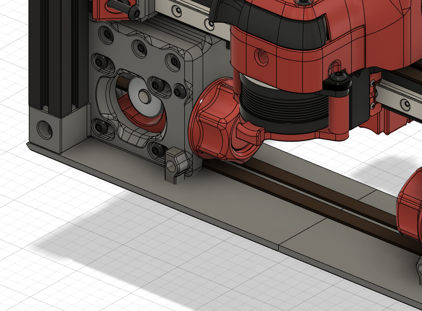
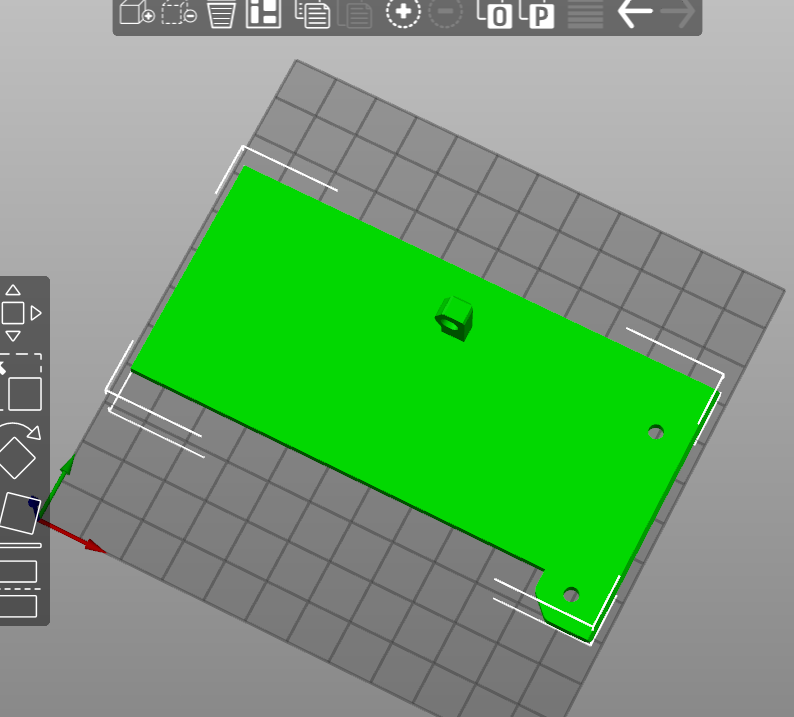

Scrolling through Discord, there are V0 owners like me that experienced really hot electronics or motors because of the enclosed back of the printer.
As a serious adult without kids or furry kids, you could leave the backplate off the printer to allow for airflow for the electronics/motors. 
Unfortunately this will result in losing hot air from the print chamber. 
So in addition to Weaslus "Electronics-Bay-Separator" or the V0.1 revision motor panel I have sketched this "Micro Backplate" out of the original
corners for the backplate. It is split in two parts to fit on a spec V0. 

For mounting you will need: 
- 2x M3x35 as replacement for 2x M3x30 in the A-B-Motormounts
- 2x M3x8 for mounting on the V0.0 or V0.1 frame. M3 nuts should already be in the 1515 profile.
- 2x M3x6 for mounting on the V0.1 A-B-Motormounts

