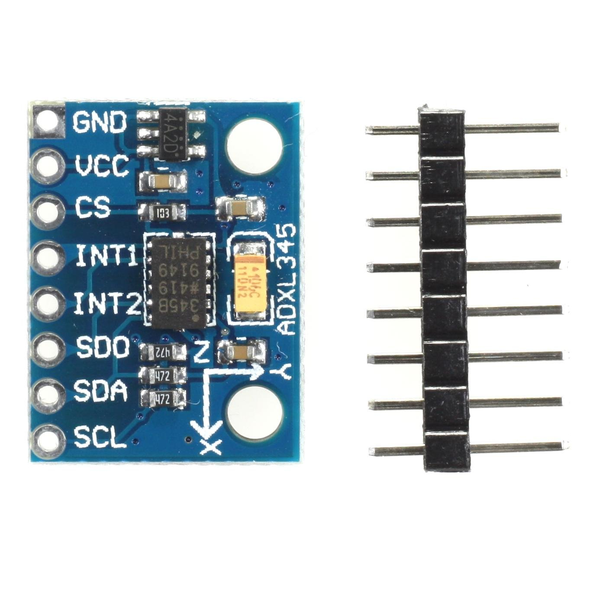
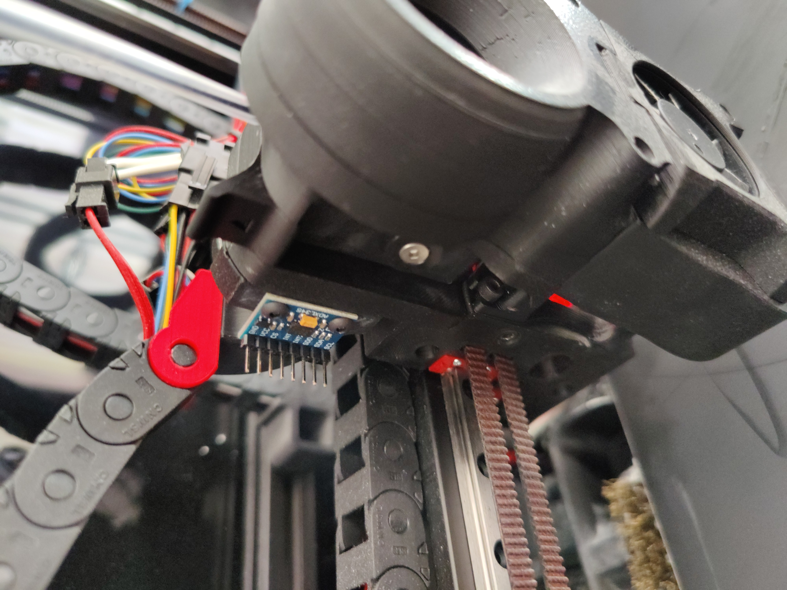

ADXL356 mounts for the Galileo extruder
============================

These are my edited standard galileo chain mounts to be able to mount an adxl356 against it permanently. 
I attached them with two M3x6. It'll work for an adxl356 of the following layout:

It'll end up looking like this:
