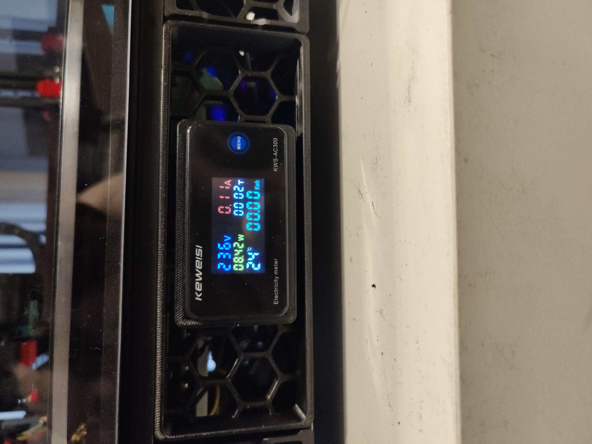

V2 Power Skirt
============================

A skirt piece to replace the lefthand (empty) or righthand fan holder with this. 
I bought the screen here: https://nl.aliexpress.com/item/4001268132948.html?spm=a2g0s.9042311.0.0.48094c4dXCEnMz
I chose the one with the torus because that's the easiest to install one.

Steps to install:
1) Disconnect printer from mains
2) Connect the screen's wires (L-N and CT). You can also plug in the provided temperature sensor already, just be careful when inserting the screen into the skirt.
3) Slide the screen into it, it should be press fit, maybe a bit on the loose side.
4) Slide the torus over the mains input, before you split it off to power the PSUs/Bed. This way you measure the entire printer, not just one branch of the split.
5) If you didn't do the temperature sensor at 2, now's your moment to do it. I tiewrapped mine to a wire so it measures the electronics compartment. 
6) Remove the M5 T-nut from the rail and insert two M3 T-nuts to hold the skirtpiece. 
7) Fasten with 2 M3*8.
8) Power up.

