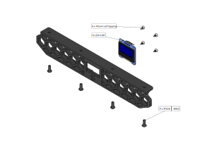
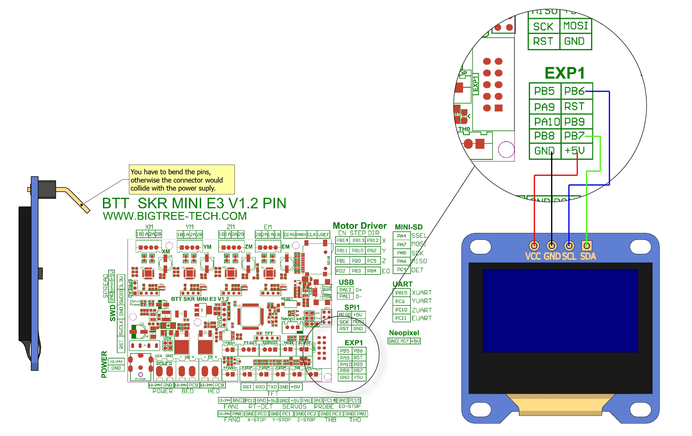

--------------------------------------------------------------------------------
V0 | 0.96" OLED
--------------------------------------------------------------------------------
<p align="center">
  
</p>

Use an 0.96" OLED for displaying:
- hotend temperature
- heater temperature
- fan
- flow
- time (ellapsed|remaining)
- coordinates x|y|z

--------------------------------------------------------------------------------
Wiring
--------------------------------------------------------------------------------
used OLED-display:
[0,96"OLED](https://www.aliexpress.com/item/32695790661.html?spm=a2g0s.9042311.0.0.27424c4dXvvuBS)

The display has to be qualified for 5V

<p align="center">
  
</p>

--------------------------------------------------------------------------------
Firmware
--------------------------------------------------------------------------------
For SKR mini E3 v1.2 insert in your Klipper config:
```
[display]
lcd_type: ssd1306
```
