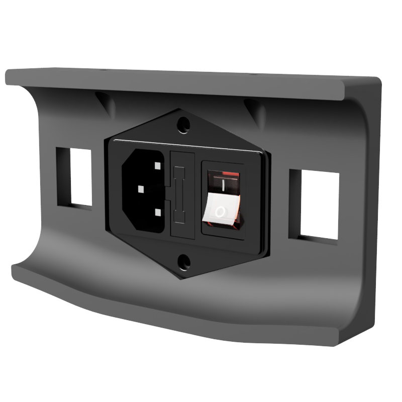

# Plug Panel for IEC320 C14 mains inlet

A subsitute plug panel for the budget IEC320 C14 main inlets commonly found online.

Includes STL, 3MF mesh formats for slicing. F3Z Fusion 360 archive for your modifications.

