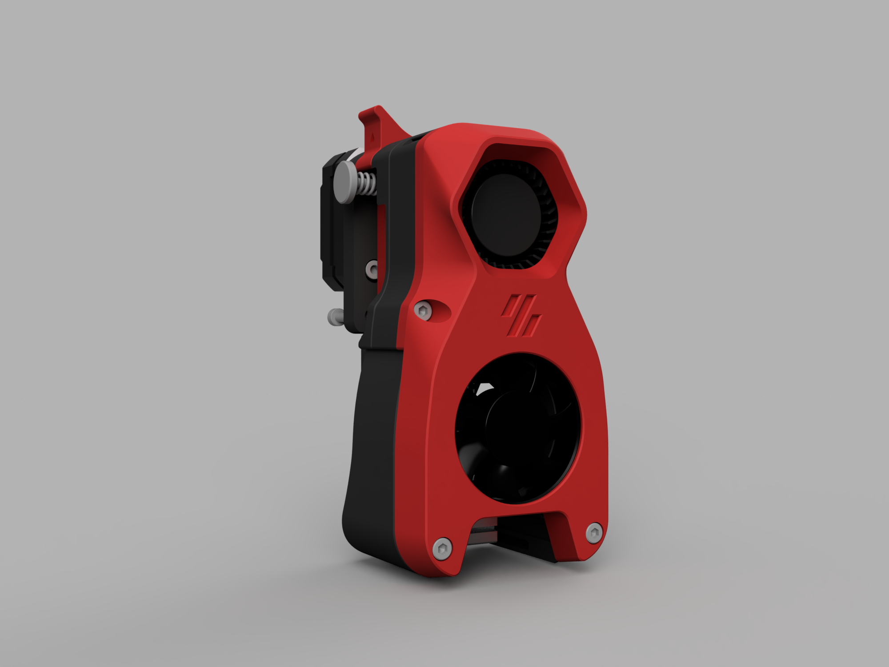
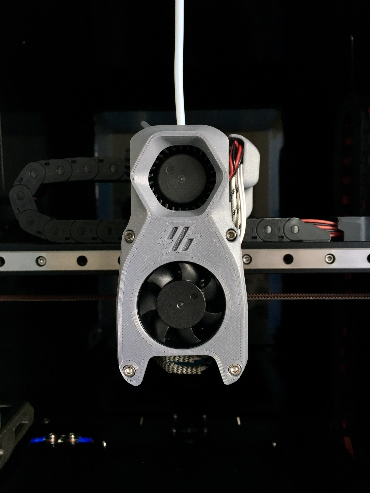

# Voron Afterburner Turbo Mod

This is a **purely cosmetic** mod for the Afterburner to bring it's appearance closer to Stealthburner.

After having seen Stealthburner, Afterburner's design started to look a little dated to me. So I designed this mod.
It simply replaces both of Afterburner's front parts with a single part. The only new hardware required are two shorter screws.

## BOM
| Item | Qty. | Note |
| --- | --- | --- |
| SHCS M3x20 | 2 | Replace two SHCS M3x30 |

## Images

