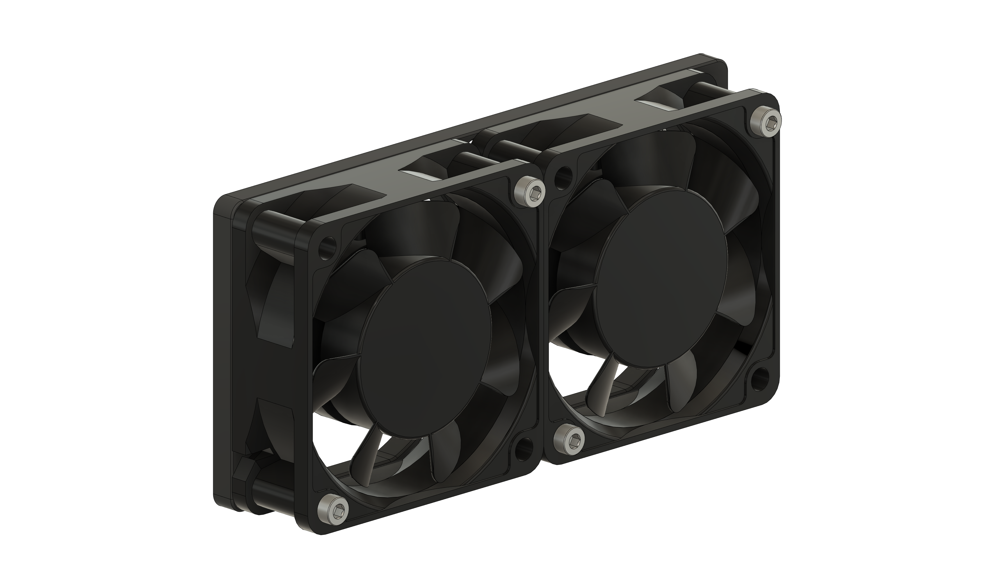
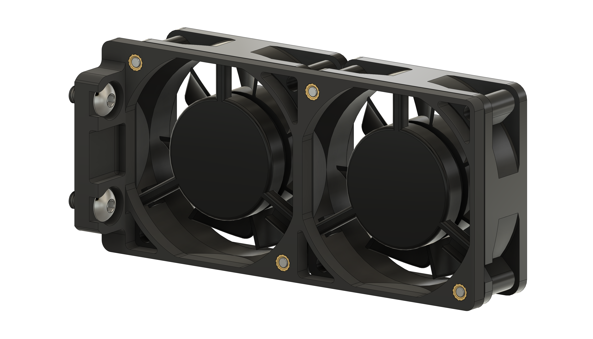
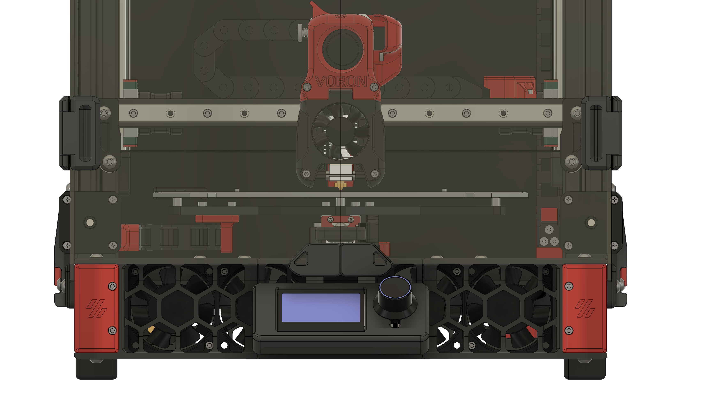

# Double 60mm Fan Mount for Voron Switchwire

This is a simple mount for two 60mm fans in Switchwire's electronics compartment.
It uses screws instead of VHB tape and was inspired by [this mod](../../csch0/SW_FanMount_No_Tape).
Of course you can also print it twice and mount four fans.

Note that using fans in this position only makes sense if you use the deck and bottom panels, as they form an air tunnel.
Without them, the fans will only blow against the frame and the air will not reach the electronics.

## BOM
| Item | Qty. | Note |
| --- | --- | --- |
| BHCS M5x10 | 2 |
| M3 Heat Set Insert | 4 |
| SHCS M3x25 | 4 | Screw length depends on the fans used |

## Images

