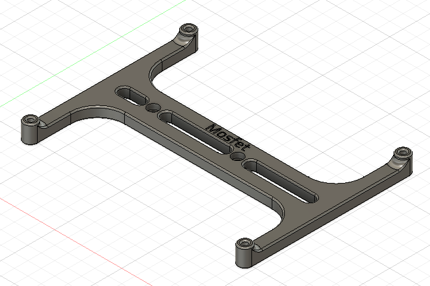
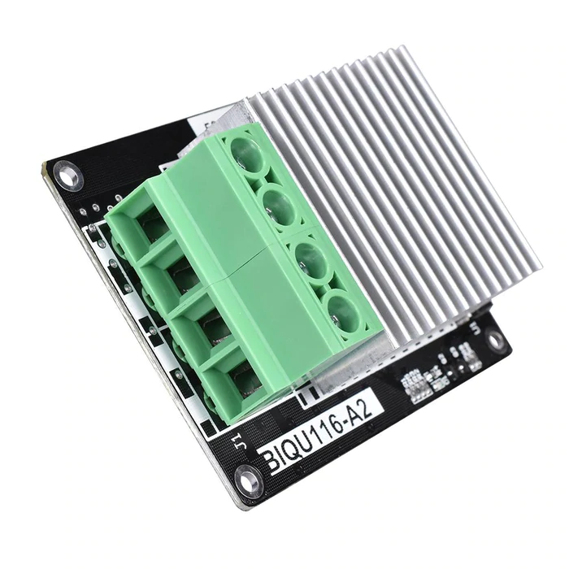

**MKS Mosfet Mount**

A mount for a [BIQU116-A2 MKS Mosfet](https://www.biqu.equipment/products/3d-printer-parts-heating-controller-mks-mosfet-for-heat-bed-extruder-mos-module-exceed-30a-support-big-current) based on the Trident Raspberry Pi mount. Use an extra pcb_din_clip_v2 to fix it to the DIN rail.

