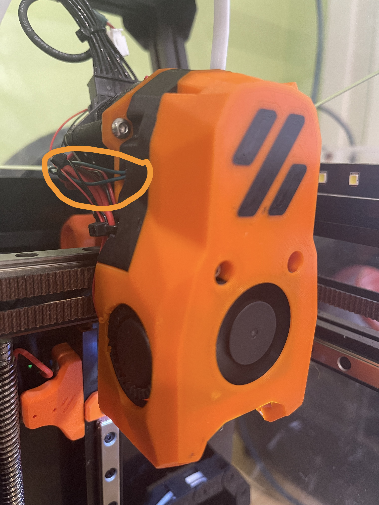

# mini-SB_ERCF_Edition
I designed this model to install an ERCF on the V0.2r1 mini Stealthburner, as I designed it for the ECAS04

He modificat les peces originals de VoronDesign per tal de poder-hi encabre-hi un sensor de filament identic al que han dissenyat per a la pota trasera de la V0.2r1.
La part midBlock és la que he hagut de modificar més i no ha quedat tant senzilla d'imprimir com l'original Per això he posat unes peces de suport que sempre es poden deshabilitar des del slicer. He fet dues versions d'aquesta peça. La primera respectant la geometria de la peça inicial per tots aquells qui no volgueu instal·lar un ERCF i amb el tub de PTFE ja n'hi ha prou. L'altre versió està dissenyada per instal·lar-hi un connector ECAS04.
També he posat un conducte per als cables per tal que surtin just on passen els altres i quedi el màxim de dissimulat. En el meu cas, tinc instal·lada una Picobilical i com que faig el sensorless homing tinc el connector del X_EndStop lliure 

I modified the original VoronDesign parts to fit a filament sensor identical to the one they designed for the V0.2r1 rear leg. The midBlock part is the one I had to modify the most and it wasn't as easy to print as the original. That's why I put some support pieces that can always be disabled from the slicer. I made two versions of this piece. The first respecting the geometry of the initial part for all those who do not want to install an ERCF and the PTFE tube is enough. The other version is designed to install an ECAS04 connector.
I also put a duct for the cables so that they come out right where the others pass and it is as hidden as possible. In my case, I have a Picobilical installed and since I do sensorless homing I have the X_EndStop connector free

Les altres dues peces que he hagut de modificar són el Front Cowling i el Latch.
El Front Cowling per eliminar una part de l'encaix que colisionaria amb el microruptor.
El Latch per evitar que fregui amb el connector ECAS04.

The other two parts I had to modify are the Front Cowling and the Latch.
The Front Cowling to eliminate a part of the lace that would collide with the microswitch.
The Latch to prevent it from rubbing with the ECAS04 connector.

El Front Cowling no cal tornar-lo a imprimir, simplement s'ha de tallar amb cutter o amb calor la part que està resaltat a una de les fotografies. És per evitar que el Front Cowling toqui el microruptor. 

The Front Cowling does not need to be reprinted, simply cut with a cutter or with heat the part that is highlighted in one of the photographs. It is to prevent the Front Cowling from touching the microswitch.

Un cop muntat, es pot veure a la fotografia que la única variació externa són els cables verd que surten per un lateral. Això per a la versió amb el tub PTFE directe, la que porta el connector ECAS04 necessita un petit canvi per poder encaixar bé.

Once assembled, you can see in the photo that the only external variation is the green wires coming out of one side. This is for the version with the straight PTFE tube, the one with the ECAS04 connector needs a little change to be able to fit well.

 

Translated with Google Translator

