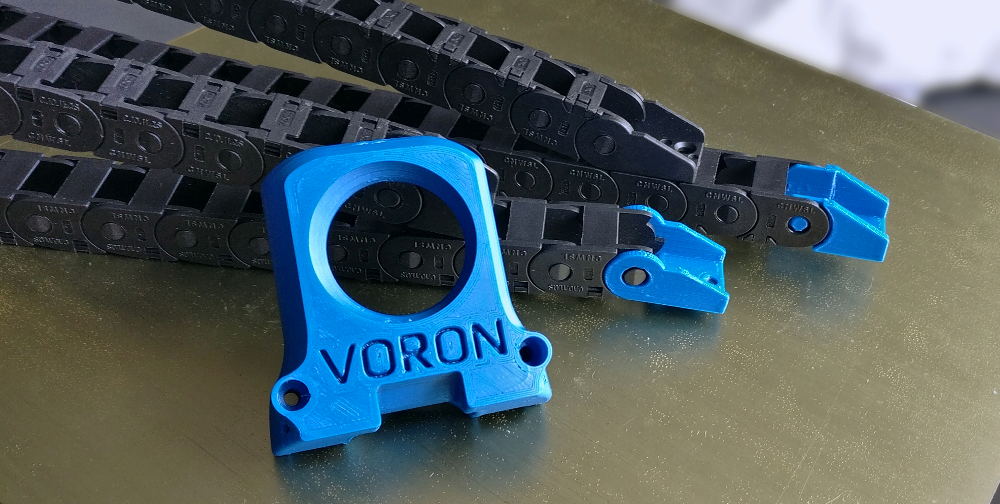
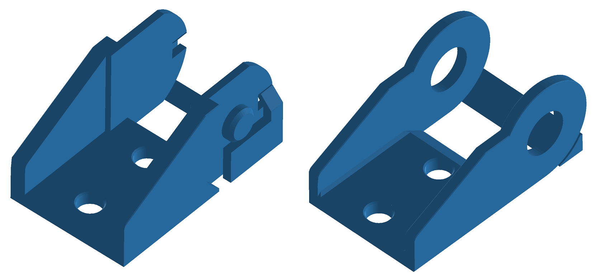
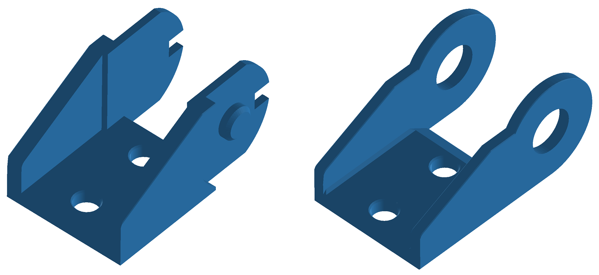

# Printable Endcaps for 10x11 Cable Chains

## Overview
These are printable endcaps, based on this [Thingiverse model](https://www.thingiverse.com/thing:3993841). I changed the 3 hole design to a 2 hole version such that you can firmly mount it on the 2020 extrusion. The endcaps ensure that you do not have to purchase two 10x11 cable chains or seperate endcap pieces. You can print these in black such that it matches the chain or in your accent color for fancier looks. 

## BOM
* 1x [10x11 Cable chain](https://www.aliexpress.com/item/33000014666.html)
* 4x M3x6 or M3x8 BHCS.
* 4x M3 T-nut HNTAJ5-3.

## Printing instructions
Personally, I printed the version with build-in supports and only had some minor cleanup to do. I have also included a version without supports for you to try. The parts are designed around 0.4mm line width and 0.2mm layer height.

## Questions
Hit me up in Voron's [Discord](https://discord.gg/xgXWctB) if you have any questions.