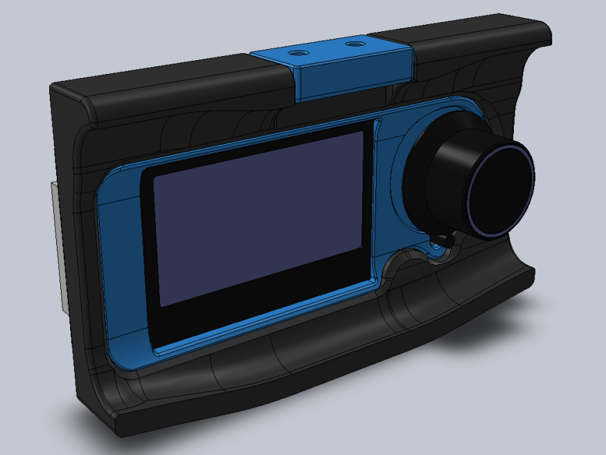

# Swiveling case for the Fysetc Mini12864 LCD


## Overview
This is a Fysetc Mini12864 LCD case for the Voron 2.4, inspired by [Schlank's Minima](https://github.com/VoronDesign/VoronUsers/tree/master/legacy_printers/printer_mods/schlank/minima) case. The design integrates the aesthetics of the Minima, while it preserves the ability to swivel from underneath the frame extrusion.

## BOM
* 1x [Fysetc Mini12864 Display](https://www.aliexpress.com/item/32972382466.html)
* 4x M3x8 SHCS.
* 4x M3x12 SHCS.
* 6x M3 Heat set inserts (M3x5x4).
* 2x M3 T-nut HNTAJ5-3.
* Super-glue or similar.

## Printing instructions
The parts are easy to print, designed around 0.4mm line width, 0.2mm layer height and no need for supports. Print the base and rear cover in your main color and the display cover and hinge in your accent color. The design is compatible with the Voron 2.4 skirts. Pro tip: use variable/adaptive layer height to print the rounding edges of the base with a lower layer height.

## Assembly instructions
Pre-assembly, please note that the Fysetc Mini12864 Display has reversed EXP1/EXP2 connectors. If you use this display in combination with a SKR controller board, please reverse these connectors by carefully pulling the connector housing from the display board and re-install them over the bare pins, turned 180 degrees.

0. Test fit the LCD display with the base, display cover, hinge and rear cover.
1. Glue the display cover to the base with super-glue or similar.
2. Press all 6 heat set inserts in the base with a soldering iron.
3. Mount the hinge to the base with 2x M3x8 SHCS bolts. Control the swiveling tension with these bolts.
4. Bolt the Mini12864 display board and the rear cover to the base with 4x M3x12 SHCS bolts.
5. Press the potentiometer knob in place.
6. Install case to the extrusion with the remaining 2x M3x8 SHCS bolts and 2x M3 T-nut HNTAJ5-3.

## Klipper configuration
The example below is provided for SKR1.3 boards with the display cables connected to the Z MCU. 
```
[display]
lcd_type: uc1701
cs_pin: z:P1.18
a0_pin: z:P1.19
encoder_pins: ^z:P3.25,^z:P3.26
click_pin: ^!z:P0.28
contrast: 63

```
Following section should be added to control the LCD backlight:
```
[neopixel my_neopixel]
pin: z:P1.21
chain_count: 3
initial_RED: 0.0
initial_GREEN: 0.0
initial_BLUE: 1.0
color_order_GRB: False
```
It is possible to include code in your print macros to change the color of the LCD backlight for different printing stages (pre-heat / printing / finish / etc.)

Please refer to [klipper documentation](https://github.com/KevinOConnor/klipper/blob/master/config/example-extras.cfg) for further info.

## Early contributors / testers
- Daniel H.
- StvPtrsn
- Navy_Chief
- Knuckl3dragg3r

## Questions
Hit me up in Voron's [Discord](https://discord.gg/xgXWctB) if you have any questions.

