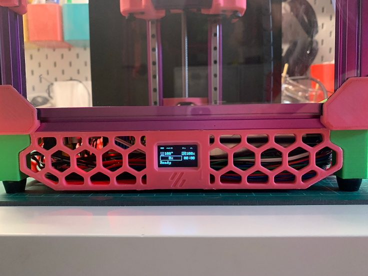

# V0.1 0.96" OLED skirt

Inspired by [`madros/V0_skirt_OLED`](https://github.com/VoronDesign/VoronUsers/tree/master/printer_mods/madros/V0_skirt_OLED), but for the V0.1. Please see that directory for installation instructions - no need to repeat them here.

OpenSCAD file provided if you want to customise (perhaps you'd like to replace that Voron logo with your serial).
You will need to grab [`Cowling_LOGO_ONLY_x1.STL`](https://github.com/VoronDesign/Voron-0/blob/V0.1/STLs/Toolheads/Mini_Afterburner/Cowling_LOGO_ONLY_x1.STL) and [`Skirt_x3.STL`](https://github.com/VoronDesign/Voron-0/blob/V0.1/STLs/Skirt_x3.STL) from [`VoronDesign/Voron-0`](https://github.com/VoronDesign/Voron-0/releases/tag/V0.1).
