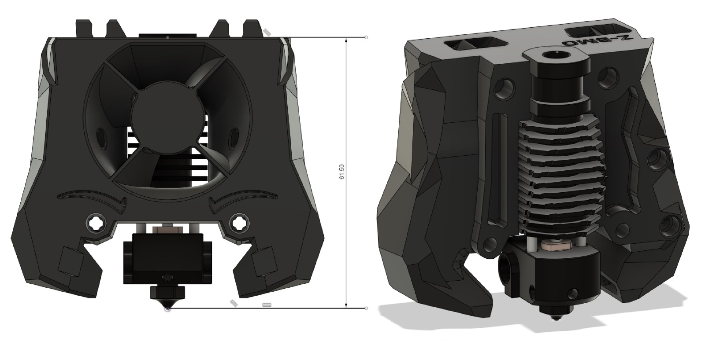

Zodiac BMO Stealthburner Toolhead
=================================

A modified toolhead for use with the Zodiac BMO Hotend and compatible with RC1 of Stealthburner.
It was created from the original RC1 Stealthburner Phaetus BMO Toolhead files.
If changes after RC1 of Stealthburner make this mod incompatible, I will provide updated files based on the official Stealthburner CAD files.
The official [Zodiac3D CAD Model](https://zodiac3d.com/pages/copy-of-datasheets) of their BMO Hotend was used for reference.

Images
-------------------------

Notes
-------------------------
For optimal fit it is very important that your printer's dimensional accuracy is nearly perfect. Especially Pressure Advance has to be tuned right.
Even then it is still a very tight fit, when putting in the hotend. That ensures that it cannot twist or wiggle.
One handed nozzle changes should be possible, but are generally not recommended.

The bowden tube length from top of the toolhead to the heatbreak of the hotend is around 31.2mm. Take that into account when calculating the total bowden length.
(E.g. Clockwork2 needs 11mm above the toolhead, so that accumulates to a total bowden length of 42.2mm, when using Clockwork2.)

Test prints were made with standard ABS, ABS+ and ASA Carbon.
