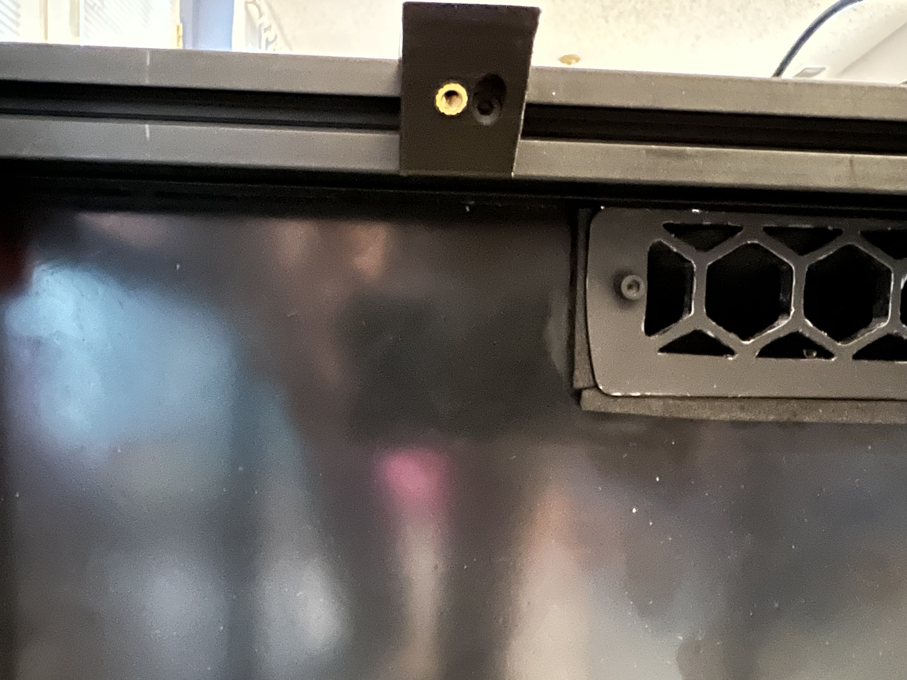
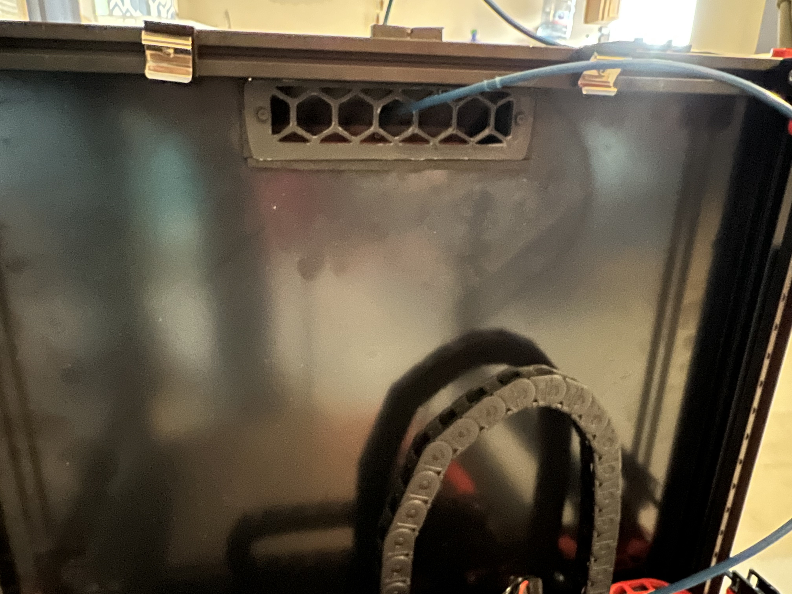
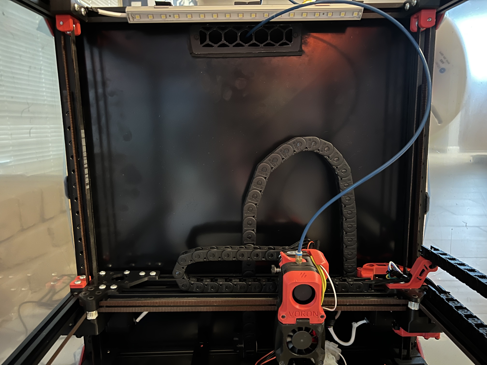

Really simple way to mount LED bar angled down. You could easily re-use this mount for anything.

# LED Bar BOM:

Mount alone:
- 2x M3 heat inset
- 2x M3x8 SHCS
- 2x M3 t-nut

LED Bar:
- 2x M3x6 BHCS for LED bar (any M3 will work for mounting anything else to it)
- 1x LED bar (you can use any bar with brackets -- this mod is really simple. the one I used: [Amazon](https://www.amazon.com/gp/product/B07RNDDYYK/ref=ppx_yo_dt_b_search_asin_title?ie=UTF8&psc=1))

# Print Settings

Same standard settings as 2.4 parts -- 40% infill, 0.2 height, 3 top/bottom are fine

Mount

Mount with LED brackets attached

LED mounted

