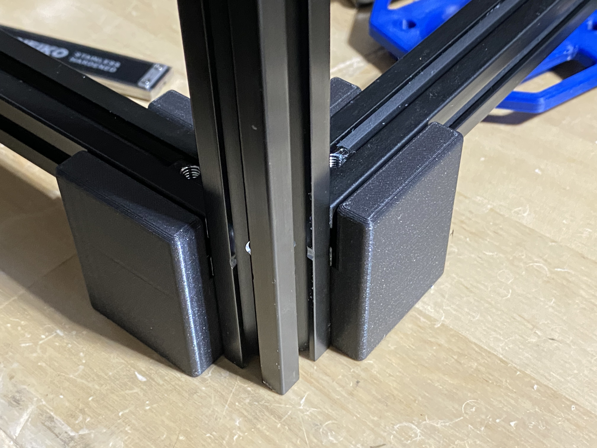

# Jig for aligning lower extrusions

## Overview
This is a jig for aligning the lower extrusions when building V1.8. This allows you to precisely align the height of the lower extrusions with a minimal amount of work.

## Printing instructions
Pretty much anything works. A good starting point is 2 perimeters and 10-15% infill.

## Usage
Loosely assemble the lower extrustion blind joints and then place the entire blind joint corner onto the jig. While on an extremely flat surface, press down firmly on both horizontal extrusions and tighten the blind screws. After doing this on all 4 corners, they should be perfectly aligned and at the exact correct height (30mm).