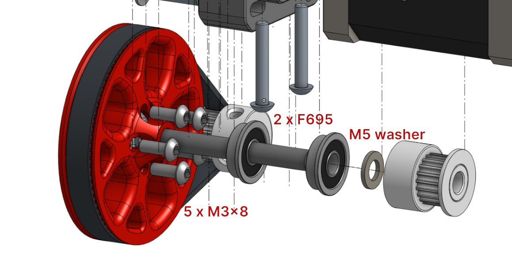
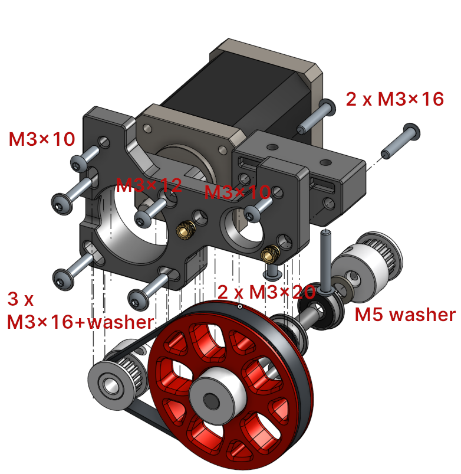
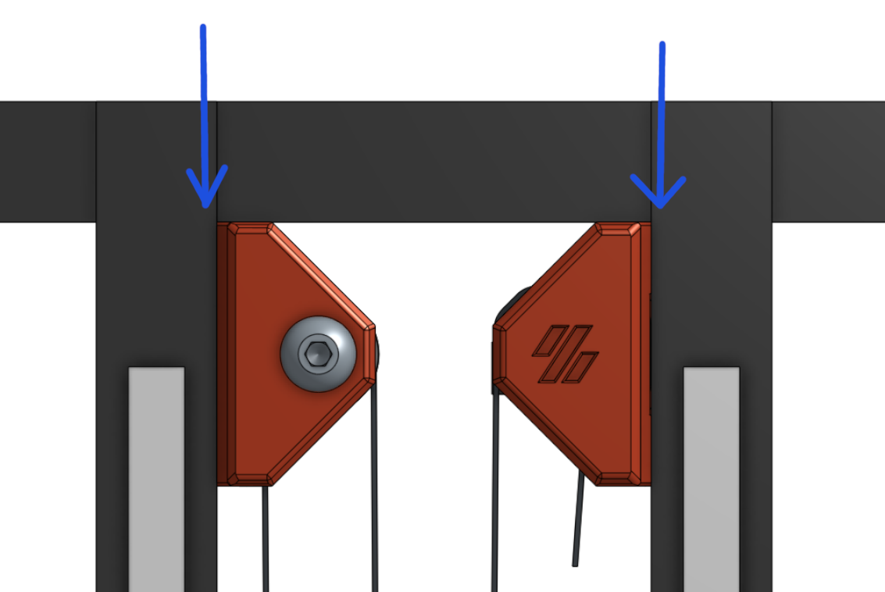

# V0.1 Movable Pulley Z Drive Mod


There already are belt-driven mods like [theFPVGeek's V0 Z Belt mod](https://github.com/theFPVgeek/VoronUsers/tree/master/printer_mods/theFPVgeek/v0-zbelt-mod) and [MathematicalPotato's adapted version for V0.1](https://github.com/VoronDesign/VoronUsers/tree/master/printer_mods/MathematicalPotato/v0.1_belted_z_drive). This is my attempt to combine the timing belt with a movable pulley system.

- M4-like driving gear(1:4) with movable pulley on Z bed(1:2), resulting in a 1:8 speed ratio, provides higher torque and step resolution. The bed doesn't drop when the Z motor is disabled.
- Using a NEMA14 stepper motor (no tight restriction in length) provides another path for V0 to V0.1 upgrade by reusing the Z motor.

## BOM (Some can be obtained from the original setup)

### Fasteners

- 1 x M2x10 Self Tapping Screw
- 2 x M3x6 BHCS
- 11 x M3x8 BHCS
- 2 x M3x10 BHCS
- 4 x M3x12 BHCS
- 5 x M3x16 BHCS
- 2 x M3x20 BHCS
- 3 x M3 Washer
- 4 x M3 Threaded Insert
- 4 x M3 Hex Nut
- 3 x M5x20 BHCS/SHCS
- 3 x M5 Hex Nut
- 1 x M5 Washer (about 1mm thick, doesn't have to be accurate)

### Motion

- 3 x GT2 20T Pulley (6mm wide / 5mm bore)
- 1 x GT2 Belt Loop (6mm wide) - 188mm
- GT2 Open Belt (6mm wide) - about 650mm
- 8 x F695 2RS Bearing
- 1 x 5x60mm Shaft
- 1 x NEMA14 Stepper Motor (LDO-35STH42-0504AH, others might also work)

## Mechanism

As shown in the following figure, the belt drive on the motor is a 20T:80T system.

The driven belt path with constant belt length is a movable pulley system with the two belt ends
fixed at the upper and lower parts of the frame.


## Instructions

### Assembly of Each Component

Note the places that need threaded inserts. You can pre-apply them.

1. M4-like driving gear

   
   

   This is very similar to [Voron M4 extruder](https://vorondesign.com/voron_m4). Just mind the placement of the F695 bearings. You can refer to [Nero's video guide](https://www.youtube.com/watch?v=oTCxGellCQk) for details about assembling Voron M4.

   The `80T_gear_7mm.stl` provided is a thinner version of the [M4 toothed gear](https://github.com/VoronDesign/Mobius-Extruder/blob/master/STLs/%5Ba%5D_80t_gear.stl) with 7mm of tooth width instead of 9mm to save a little weight and space. Both should work here.

1. Bed Holder

   

1. Top Idler

   

1. Top Endstop Mount

   
   Use the stock Z endstop and the two M2 self tapping screws.
   

### Assembly

1. Preload 2 M3 nuts at the marked slot on page 32 of the manual.

   (Note: If you don't want to take the frame apart, it *can* be mounted without these two nuts but it may be less rigid. Don't tighten the belt too much then. NOT TESTED!)


1. Make a loop on one end of the belt and press it into the printed part. Then mount the printed part to the frame with 2 M3x8 screws.

   

1. Mount each component to the frame (don't fully tighten up yet). There should be preloaded nuts if you followed the V0.1 manual. The two upper components and their nuts can be slid in from the top.

   

1. Route the belt path as shown in the [mechanism figure](#mechanism).

1. Slightly adjust the position of each component so the bed holder is at the middle of the extrusion and the four marked segments of the belt are as parallel to the Z rails as possible.

   

1. Belt tensioning.

   First mount the top endstop holder about 2-4mm lower from the top horizontal aluminum extrusion. Then route the belt end through. While holding the belt end, press the printed cover on and lock it with two M3x6 BHCS. Make sure the belt doesn't slip out.

   If the belt is still loose, pull the endstop holder upward to adjust the belt tension.

   

   (Note: As marked in the figure, keep the top idler mount and endstop mount below the bottom of the horizontal aluminum extrusion, or the mini-AB might crash into the screw heads or printed parts.)

   

### Klipper Settings

- Old format (1.8 degree motor and 16 microsteps):

```ini
[stepper_z]
step_distance: 0.0015625
```

- New format:

```ini
[stepper_z]
rotation_distance: 40
gear_ratio: 80:20, 2:1
```

## Photos


Here's a video of testing the bed motion:

[](https://youtu.be/kQ-t7eGuI5I)

## Changelog

### 2021-08-26

- Initial release
