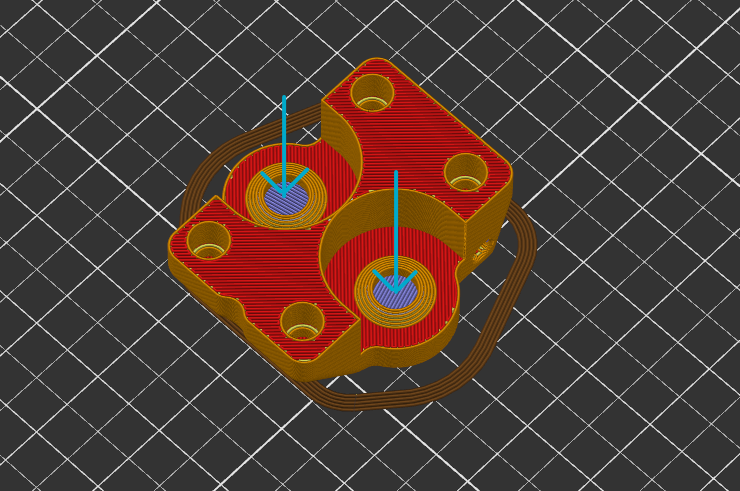

# Bed holder for kirigami bed

[kirigami bed](https://github.com/christophmuellerorg/voron_0_kirigami_bed) is a sheet metal bed designed for V0 by [Christoph Müller](https://github.com/christophmuellerorg).

This adapted holder for kirigami bed is fully contributed by **@zalupa#9238**. Thanks for allowing me to include it in this mod.

NOTE:

In `kirigami-belt-rear.stl`, there is a built-in 0.2mm-thick layer that bridges through the holes to help printing without support. They can be cut or poke through by screw easily.

