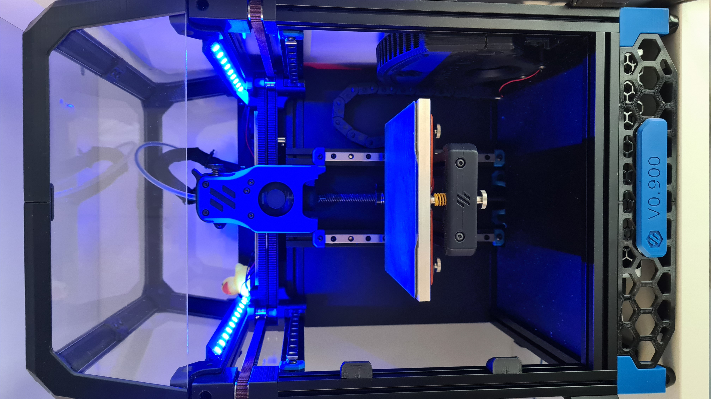

Neopixel Mount 
==============================
These are neopixel mounts that slide into the V0.1's top extrusions (20 leds in total)

BOM
---
- Neopixel/WS2812B led strip (60 leds/m) only 34cm, 20 leds are needed
- Cables 

Instructions
---
- Print 4 of the "**Neopixel_Mount**" (2 for each side)
- Solder only the 5V and GND wires on the led strips
- Slide them into the mounts
- Solder the signal wire based on the diagram below (There is a hole in the mount to allow the wire to go from the one strip to the other)
- Remove the 2 screws holding each extrusion into place
- Remove the 3 screws that attach the panels onto each extrusion
- Slide the mounts onto each extrusion and screw the extrusions in place

Neopixel Holder
---

Printed Parts
---

Circuit Diagram
---

Assembly
---

