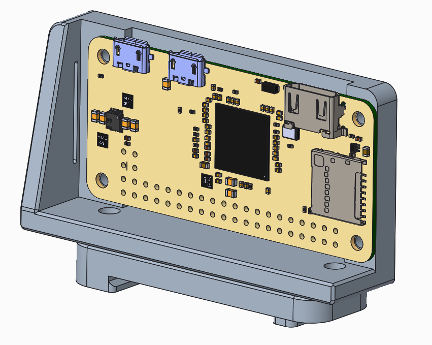
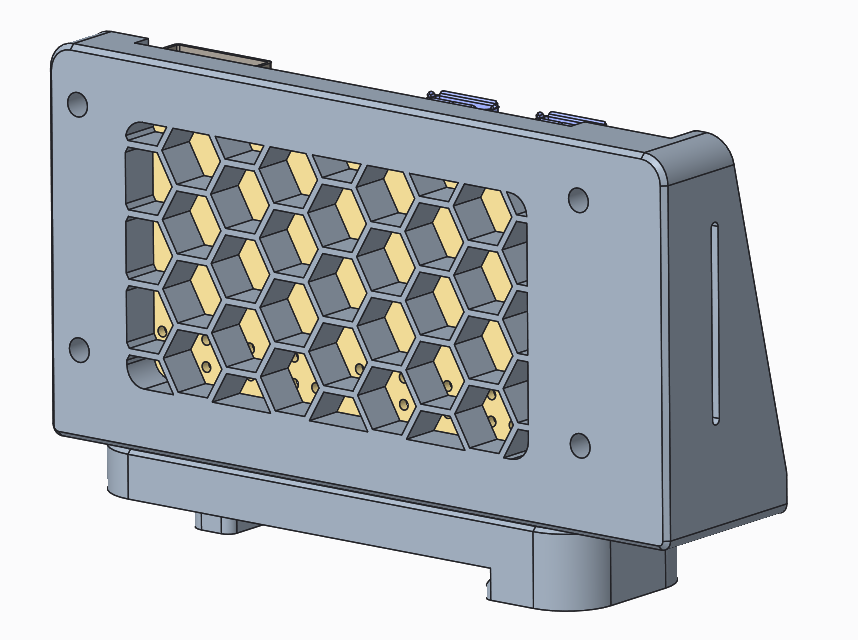

This is a bracket for a raspberry pi zero / w
the bracket mounts to the din rail using "pcb_din_clip_x3.stl"

To mount the rbp zero w, I used steel thread rolling screws for plastic pan head #3-24 thread size, 5/16" length.

