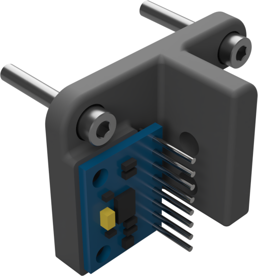
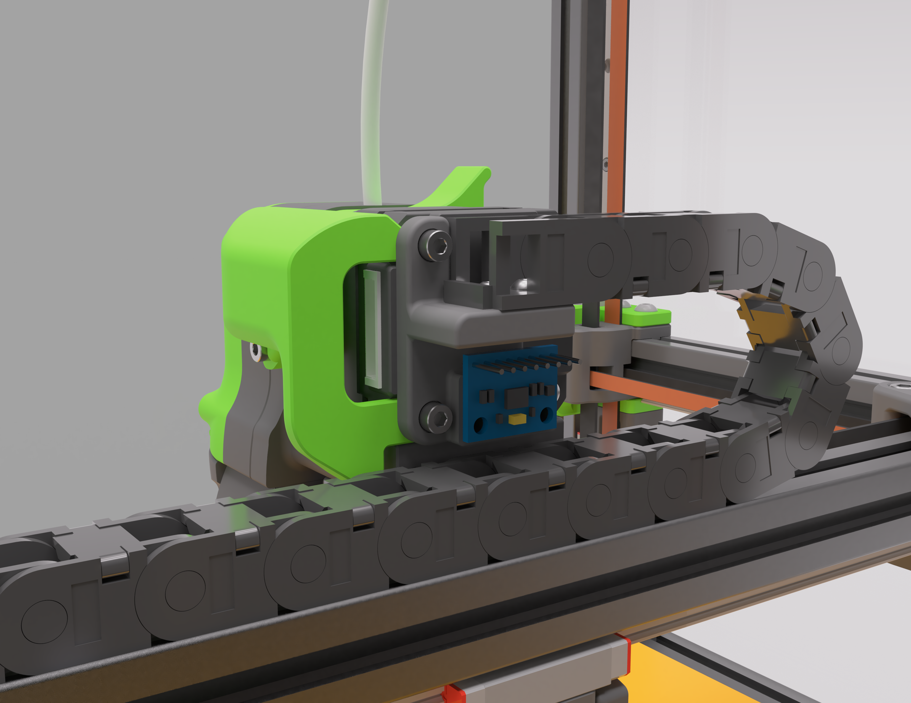
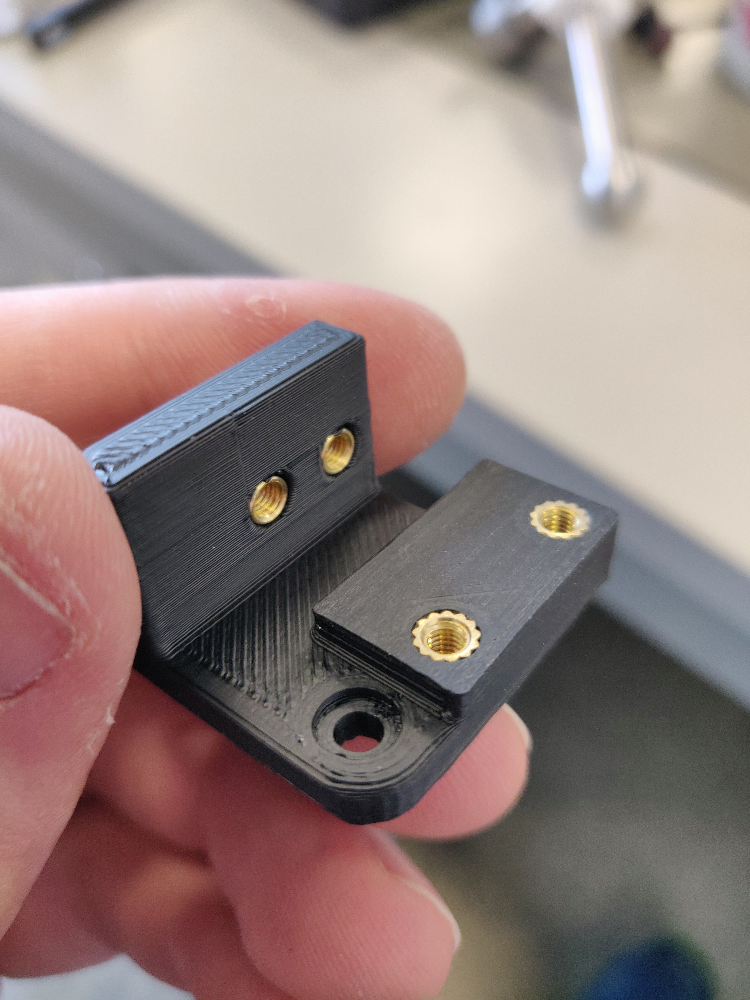
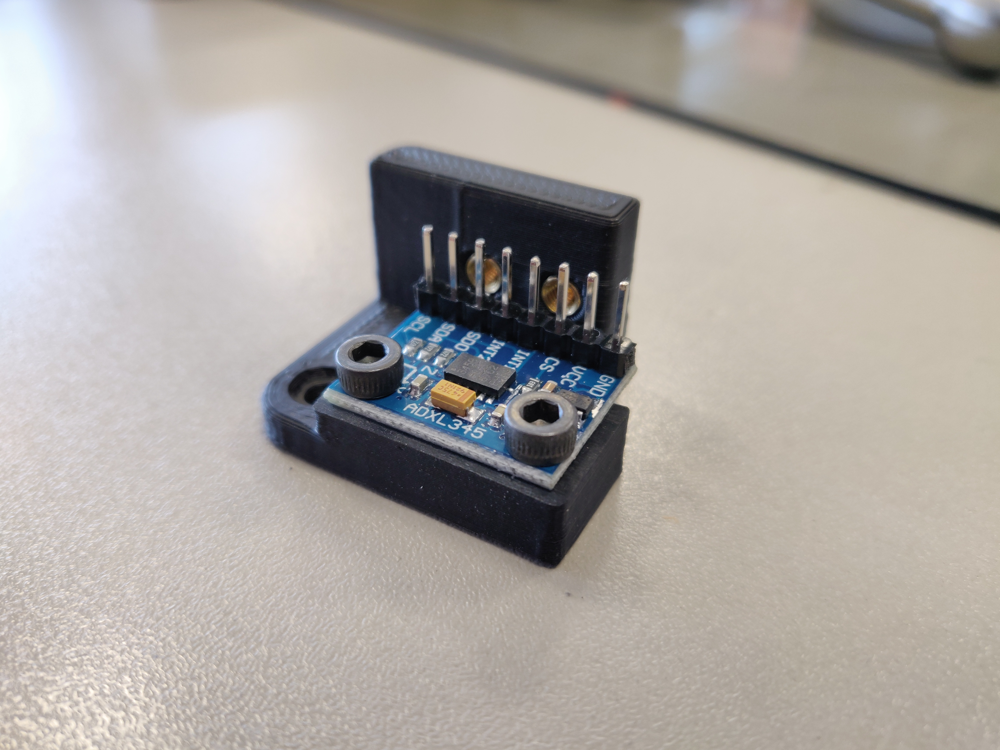
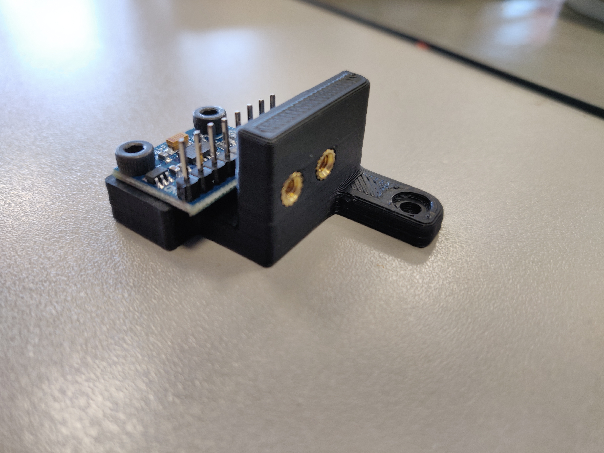
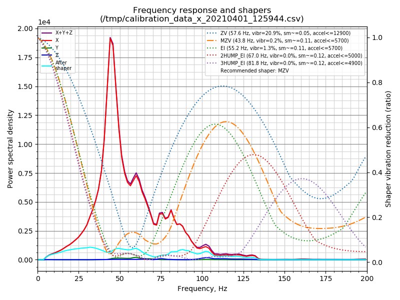
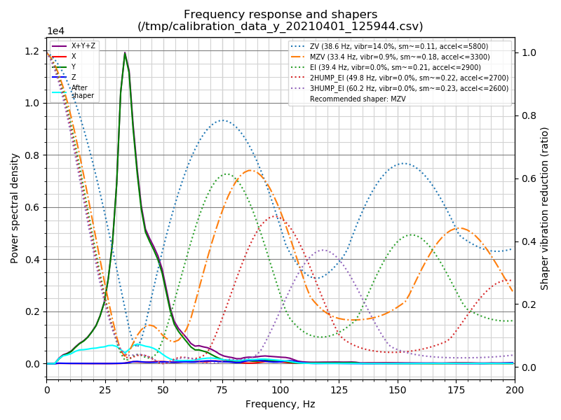

# Chain Anchor - ADXL345 mount Mod



Recently I started exploring the input shaper feature of klipper. Unfortunately I had to realize that it is not so easy to attach the ADXL345 in such a way that useful measurements can be collected.
Therefore, I have created this mod, some drawings are of course still WIP but I think I have reached a stage where it is useful to get feedback.

## Construction

I downloaded the CAD files of the Afterburner hotend and searched for a suitable place to put the ADXL345 adapter board. I found the Chain Anchor on the backside, which offered exactly the right amount of space for my purpose.



I printed the part on my printer using eSUN ABS+ Black/PeekGreen like all the other parts, but this one was unfortunately a little bit overextruded.
After adding the threaded inserts, I sanded the plateau with some P180 sandpaper that I placed on a flat surface to ensure the best possible contact surface for the adapter board.



After adding the ADXL345 it should look something like this:





After that you can use this part as a replacement for the standard chain anchor.


## BOM

| #   | Part                                               |
| --- | -------------------------------------------------- |
| /   | Afterburner: Chain-Anchor Parts                    |
| 4   | M3 standard Voron Threaded-Insert                  |
| 2   | M3x6 Screw                                         |
| 1   | ADXL345 - Triple Axis Accelerometer Breakout board |

## Klipper config

```EditorConfig
#####################################################################
#  G Sensor definition
#####################################################################
[adxl345]
cs_pin: PIN_CS
spi_software_sclk_pin: PIN_SCLK
spi_software_mosi_pin: PIN_MOSI
spi_software_miso_pin: PIN_MISO
axes_map: x,z,-y
```

## Example data




