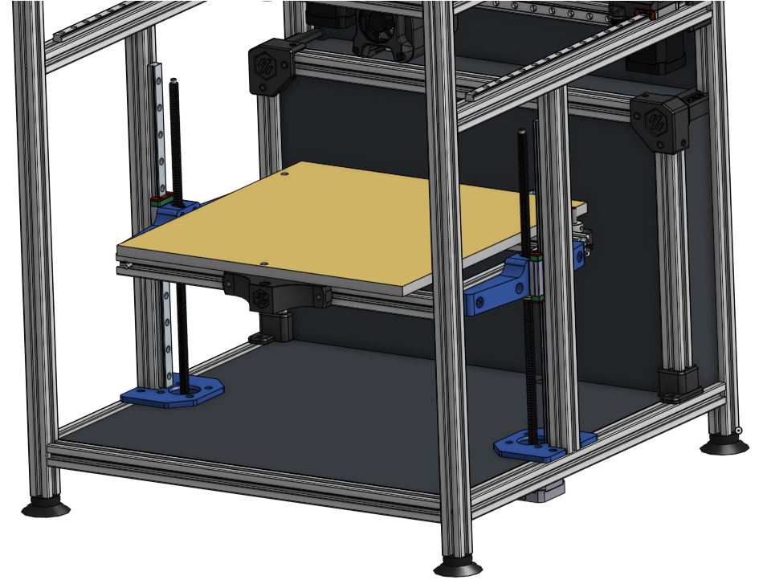

# V1.8_Z_Rails_Mod
**Z Linear Rail Mod for Voron 1.8 (300x300x250)**

**Parts list:**
* 2 modified z motor mounts (printed)
* 2 leadscrew-mgn12 blocks  (printed)
* 2 mgn12h (300mm long for 250 z) 
* 4 m3x16 shcs (lead screw nut)
* 4 m3 nuts (lead screw nut)
* 12 m5x16 bhcs (fasten blocks to extrusions and extrusions to frame)
* 8 m5 t-nuts 
* 8 m3x20 shcs (fasten blocks to mgn12's)
* 2 Misumi HFS5-2020-340-TPW (vertical extrusions for 250 z height)
* 12 m3x8 shcs (fasten mgn12 to extrusion)
* 12 m3 t-nuts
* 2 Misumi HFS5-2020-350-AH10-BH340 (x extrusions for 300x300 bed frame)

**Notes:**

The z motors are shifted inwards 2.07 mm (towards the center of the bed) so you must modify the deck panel slighly. See dxf folder.

The y gantry extrusions have an allen key clearance hole drilled 170.8 mm from the front end cut.

I've added leadscrew-mgn12 block stl's for both the 300 and 250 build sizes so choose accordingly.
Had trouble with warping when printing the leadscrew-mgn12 blocks on my ender 3 with glass bed. Had to use elmers purple gluestick for adhesion.
These blocks have been tested with the link cnc 8x2 and bigtreetech 8x8 integrated lead screws. I highly recommend the [bigtreetech](https://www.aliexpress.com/item/32977907686.html?spm=a2g0s.9042311.0.0.43bf4c4drPPHbq) 8x8 lead screws with the only downside being that the bed drops slighly when the motors turn off. 

The 2 extrusions for the mgn12 rail are aligned to the center of the bed. It is very important that the end cuts are square and exactly the same length. Misumi cut mine so no issues on my end. But since it is bolted flush to your gantry extrusion this is critical. Others have used right angle brackets with success.

You can center the mgn12 to extrusions using the stl located in the switchwire repo [here](https://github.com/VoronDesign/Voron-Switchwire/blob/master/STL/Gantry/2020_MGN12_guide_x2.stl).

The 2 bed extrusions in the x direction are shortened to 350mm because they're no longer necessary to hold the lm8luu bearing mounts. Although the stock length extrusions (420mm) will still work they will be protruding out in space.

**Testing:**

This mod has been tested by a handful of people on the Discord including myself. I am open to future improvements. Let me know if you need anything!

