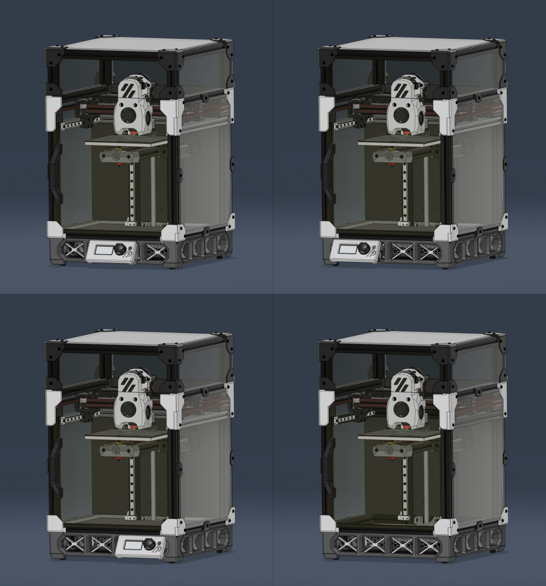

# V0 Launchpad Skirt

This is a skirt restyling mod.
Three different display positions (or none) can be selected.

Can be installed on V0.0~V0.2r1
(V0.2r1 filament sensor is not supported. Can be installed without bottom panel.)

## BOM
[**48~52**]    2x10self tapping screw(Number required depends on configuration)
