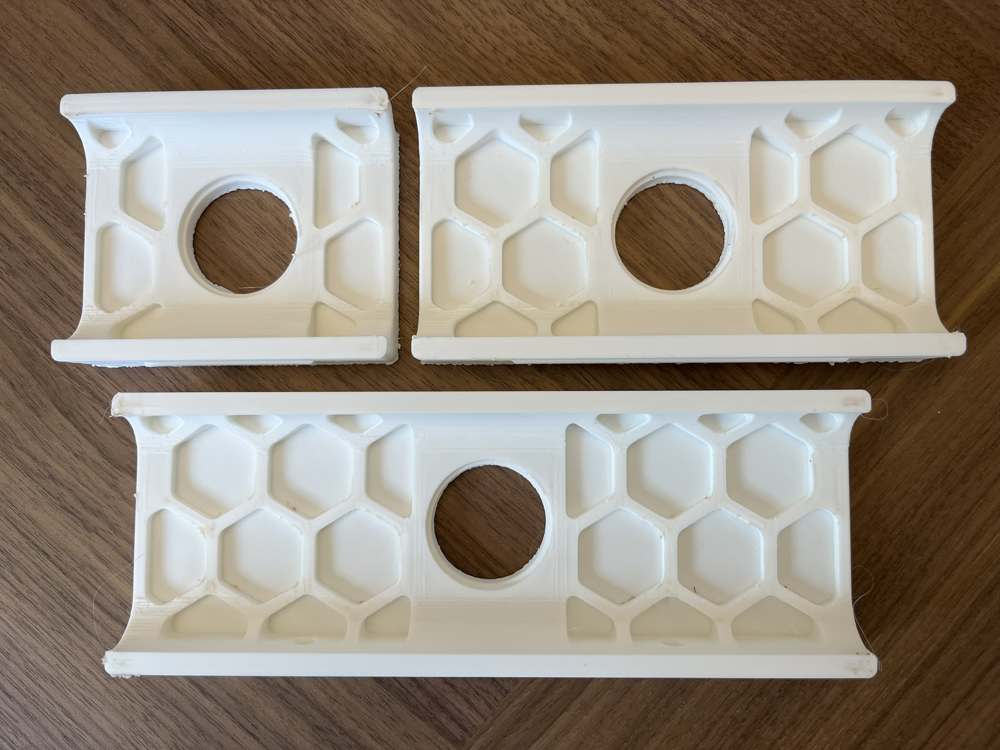
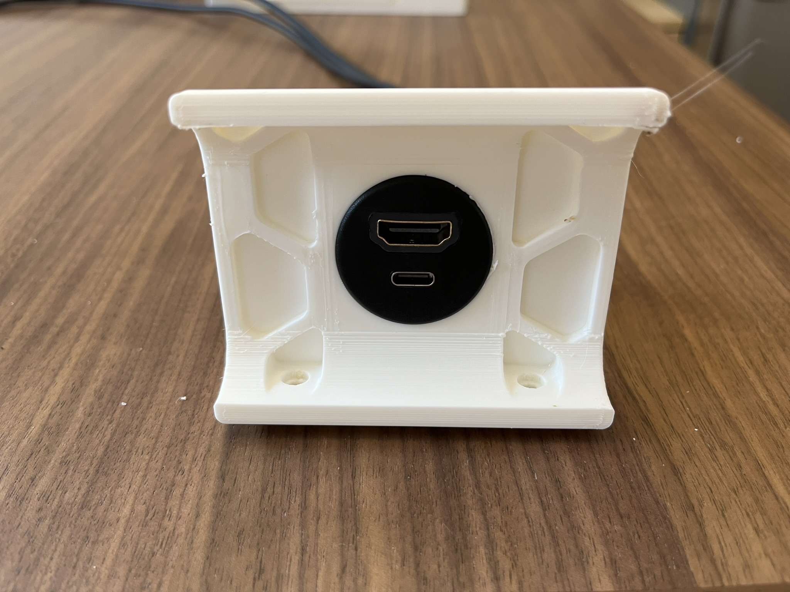
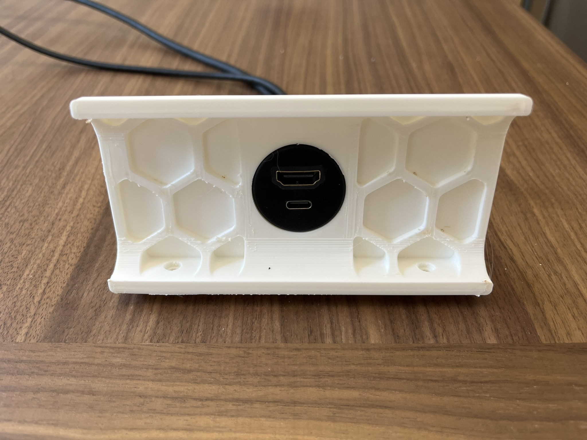
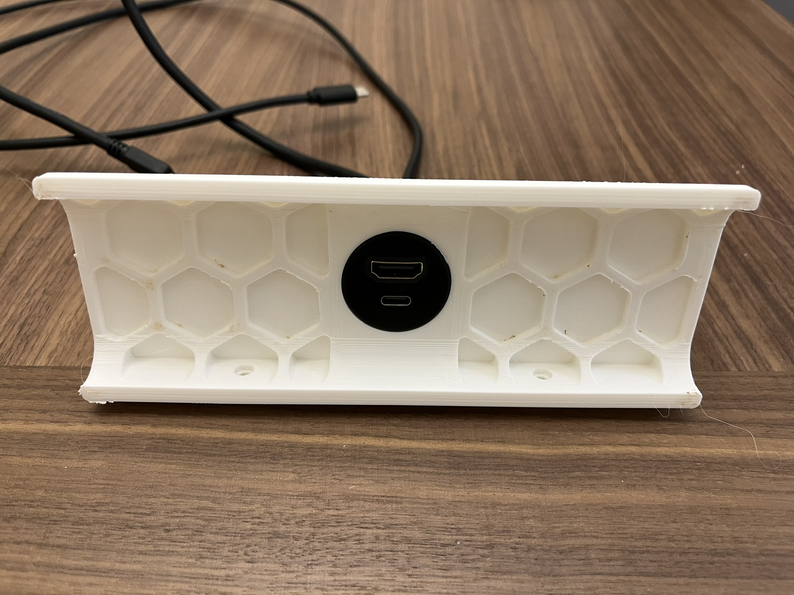
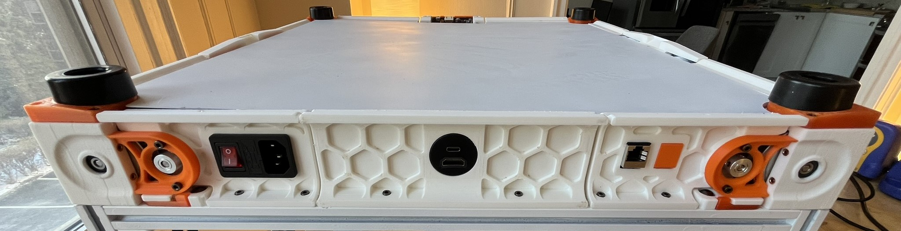
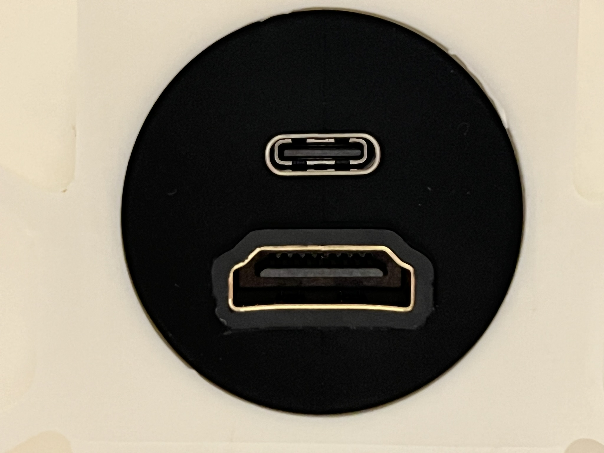
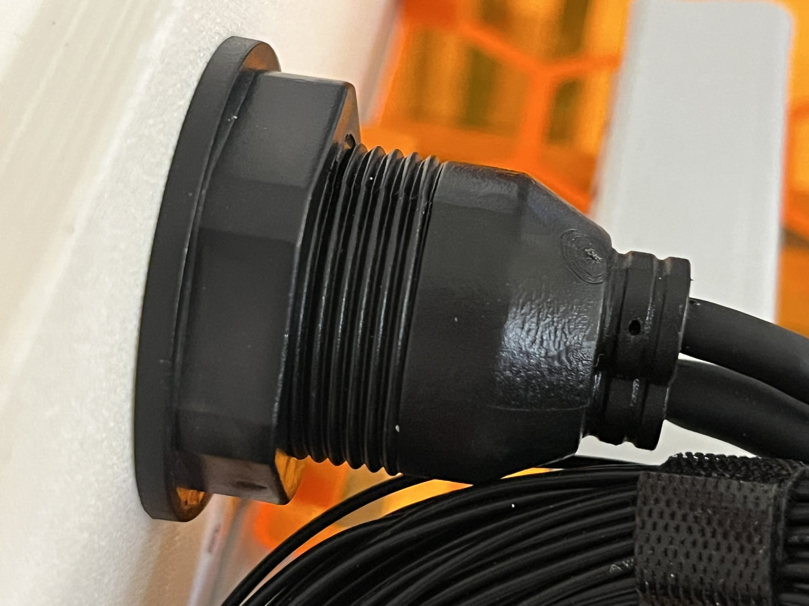

# Cable Port Flush Mount Skirt

Provides an inlet to mount BATIGE circular cable adapter ports on the rear
center skirt (250, 300, and 350) allowing easy access to display and USB headers
of the raspberry pi.

It can be used for quick access to Raspberry Pi ports often out of reach
underneath the printer without needing to flip over the printer.

## Usage
This example uses the [Micro-HDMI and
USB-C](https://www.amazon.com/dp/B0C68MPKHV?ref=ppx_yo2ov_dt_b_product_details&th=1)
variant of the BATIGE Flush Mount, however other this mod is suitable for other
variants that satisfy a [similar form factor](https://www.amazon.com/stores/BATIGE/page/ADB1F3D7-7733-487F-B5AB-6F021FF57798?ref_=ast_bln). This item is simply placed
in the opening in the rear skirt and secured in place with its included nut.

## Printing

Use standard voron print settings. 4 walls, 5 top & bottom laters, 40% infill.
