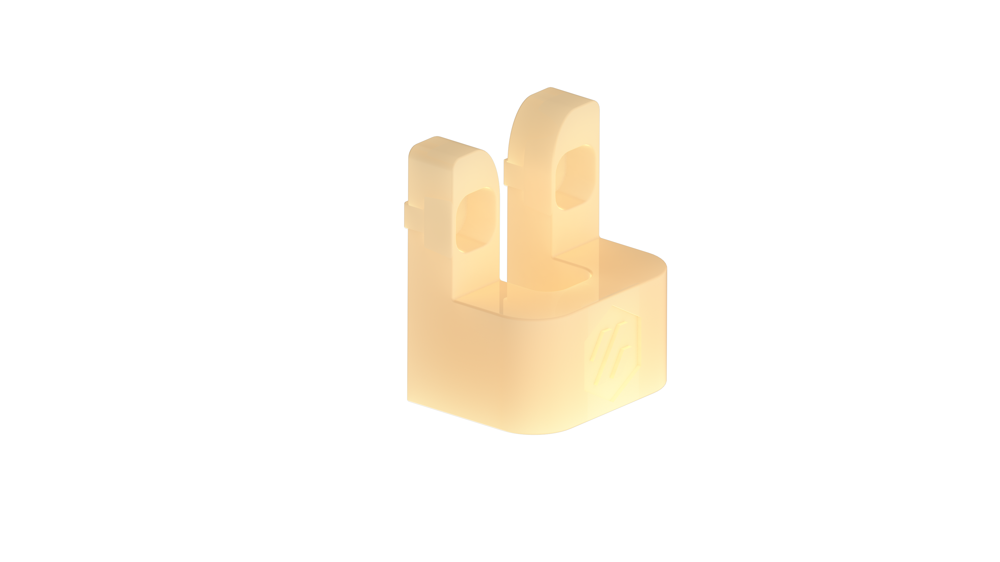
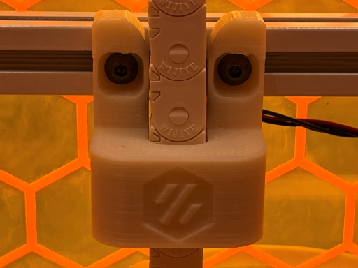

# Enclosed Z-Chain Guide

Supports Z-Chain from both sides and keeps it from sliding around, especially for taller builds.

## Installation
- Requires:
  - M5 x 10mm BHCS (Count 2)
  - M5 x T-Nut (Count 2)

- Clearance:
  - Clears conventional toolhead installations.

## Printing

Use standard voron print settings. 4 walls, 5 top & bottom laters, 40% infill.

