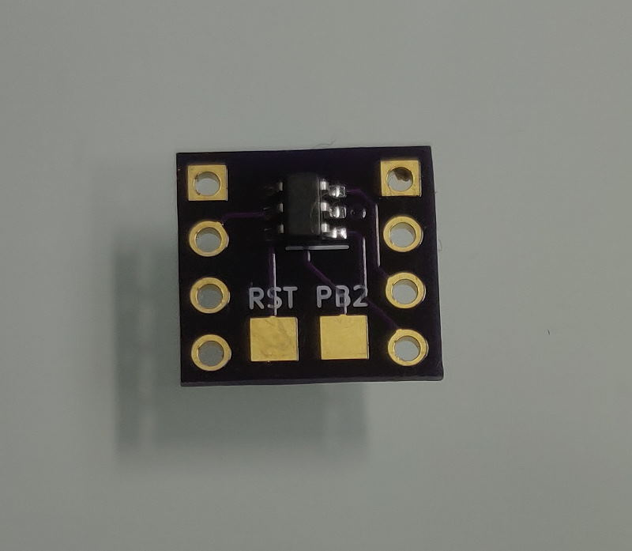
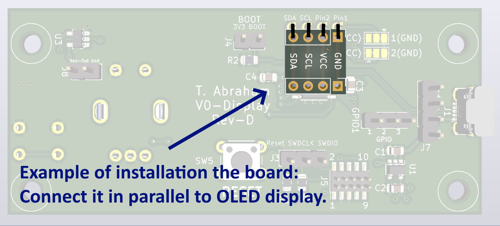

**Voron V0/V0.1/V0.2 3D printer OLED Display boot logo board.**

This board will show the animated logo on OLED display of your VORON V0 3D printer right after turning power on. Logo will stay on screen while op system is booting.

This is a DIY project.

**Specification:**

- PCB size: 11.5mm X 10.5mm
- Supply voltage: 3-5VDC
- Supply Current: 3mA max
- Supported display: any 128x64 OLED display with SSD1306 controller

**Installation instruction:**

Solder the board in parallel to the OLED display using 4 wires: GND, VCC, SCL, SDA

**DIY**

- PCB can be ordered at OshPark: https://oshpark.com/shared_projects/CGdilsaI
- The MCU Attiny10 can be ordered at Mouser: https://mou.sr/457LQlj
- The firmware: [firmware hex file](firmware/firmware.hex)

Or you can buy ready made board on eBay: https://www.ebay.de/itm/145217917896
