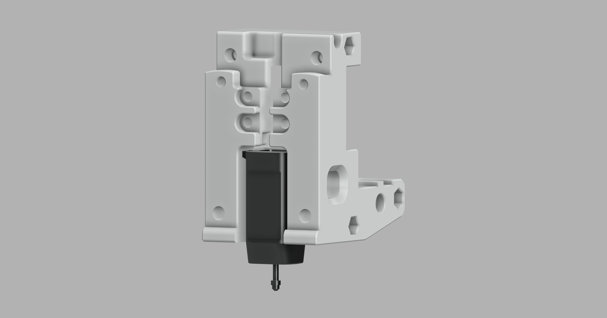
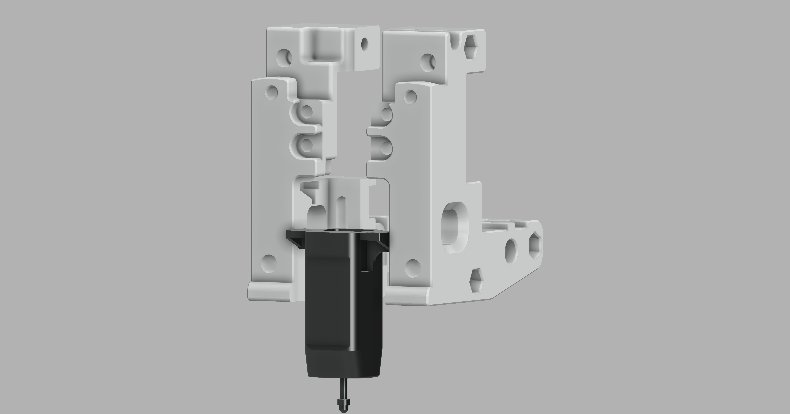

# Voron Switchwire StealthBurner CR Touch Mod

This repo contains the STL for Voron SW SB CR Touch Mod.

I used the SB 1.05Beta during development. But it should work on the SB v1 release as it's only X rail carriage.

- The STL is only for MGN12 Carriage for SW
- No supports are needed during the print
- No tools are needed to fit the CR Touch, it's a **press fit**
- I used Dragon Standard hotend for deciding height of CR touch and it's 2mm above the nozzle when pin is up
- It should work with other hotends as well (Hotends of same form factor as Dragon)

## Preview of how CR Touch Fits in the SB X rail carriage:

### Thanks to Voron Developers for building rocket making tools
