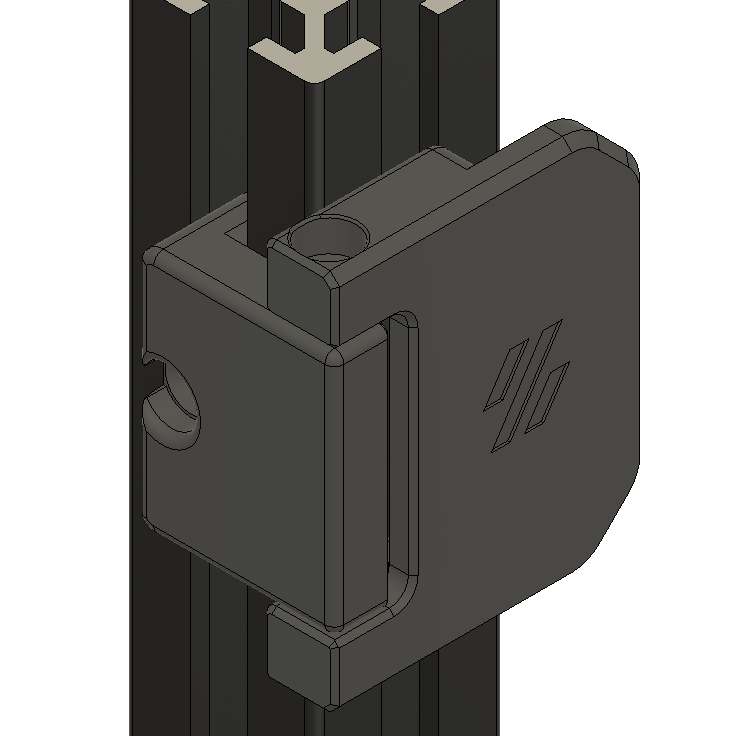

Door hinges mod for v2
- use m3 screw and heat insert as shaft (inspired by mosher)
- adjusted to 3mm panel thickness
- Doors can be opened approx. 190 degrees

What you need: (3mm thick panels)
4x Heat insert
4x M3x35mm screw SHCS

