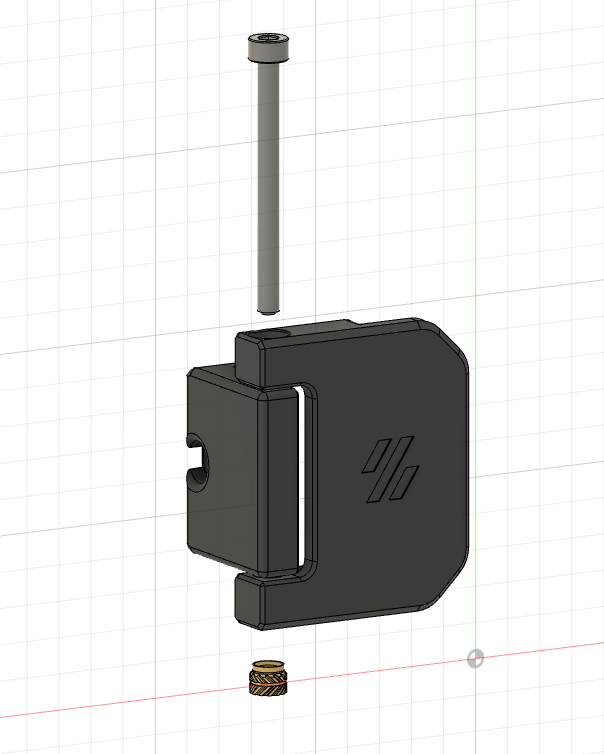

Door hinges mod for v2
- use m3 screw and heat insert as shaft (inspired by mosher)
- adjusted to 3mm panel thickness
- Doors can be opened approx. 190 degrees

What you need additionaly to the original door hinges:
4x Standard Voron Heat insert
4x M3x35mm screw SHCS

Assembly instructions: Insert the heat insert from below as seen in the picture. Assembly to the Frame on the sides of the printer with the standard M3x8mm and Hammerhead nut.

