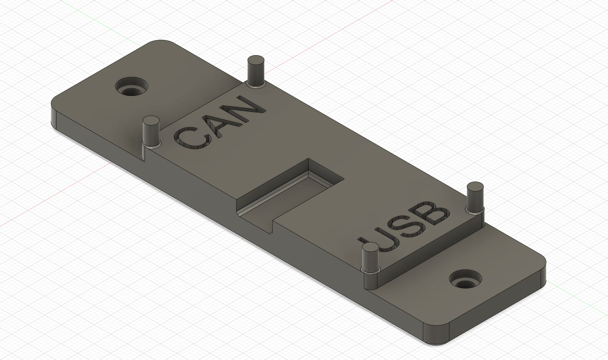
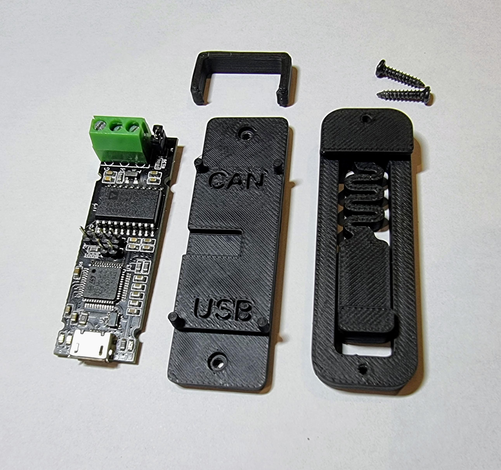
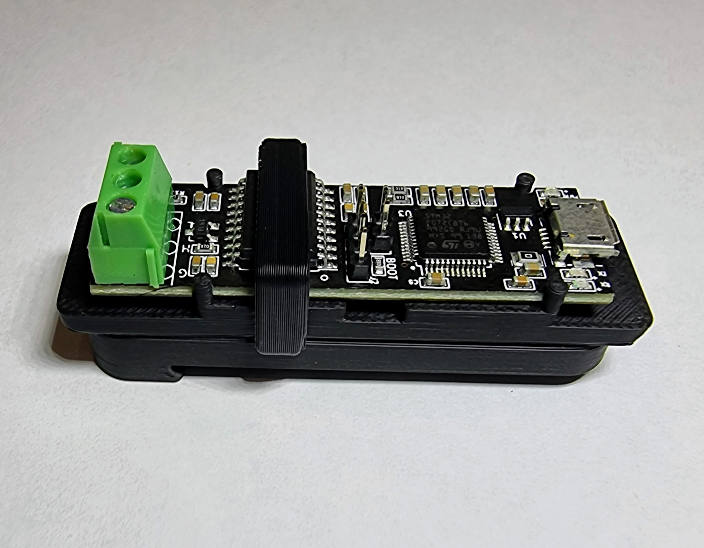

## MKS CANable Pro DIN rail mount

This mod is to mount the MKS CANable Pro to a standard 35mm DIN rail.

The CANable Pro is held from moving along its longest axis by the 4 locating pins and held onto the mount by a clip over the CAN transceiver holding it in place.  The board can only mount one way due to the header pins and for any doubt the output directions are labelled on the mount.

**To print you need**
 - canable_pro_clip.stl 
 - canable_pro_mount.stl 
 - pcb_din_clip.stl (credits to the Voron team for making this)

And 2*M2x10 self tapping screws or if you don't want one of the screws poking out a shorter one (5-7mm) or just cut the end off with snips.

To assemble, screw the mount onto the PCB DIN clip and then place the board on the mount with the outputs aligned in direction shown on the mount.  It should sit flush as shown below and then the clip slips over the top and locates into 2 small indents.

Enjoy!

Thanks to @Micko SE & @Maz for their CAD help.