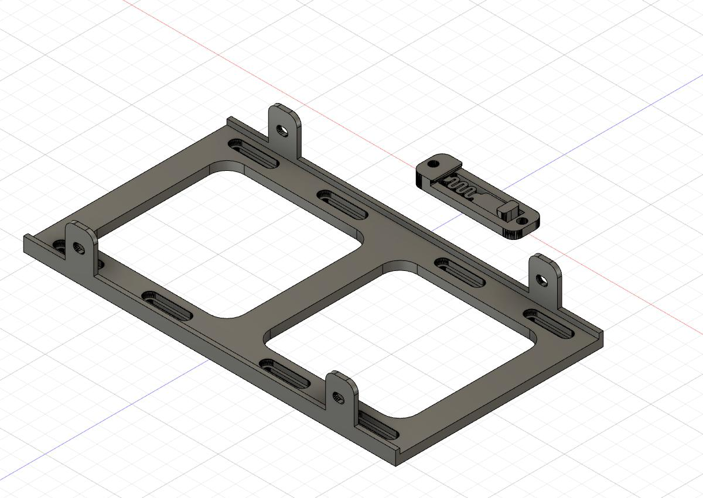
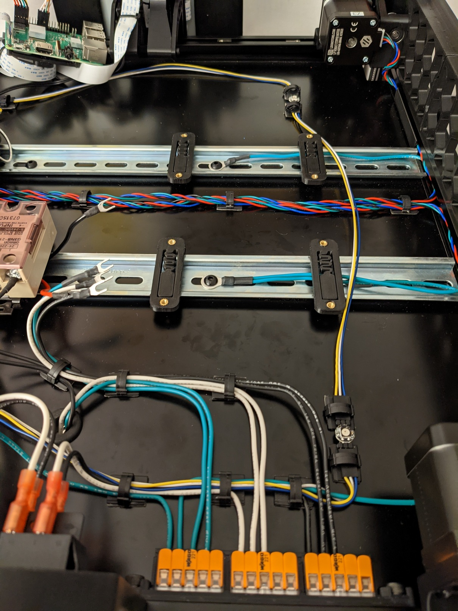
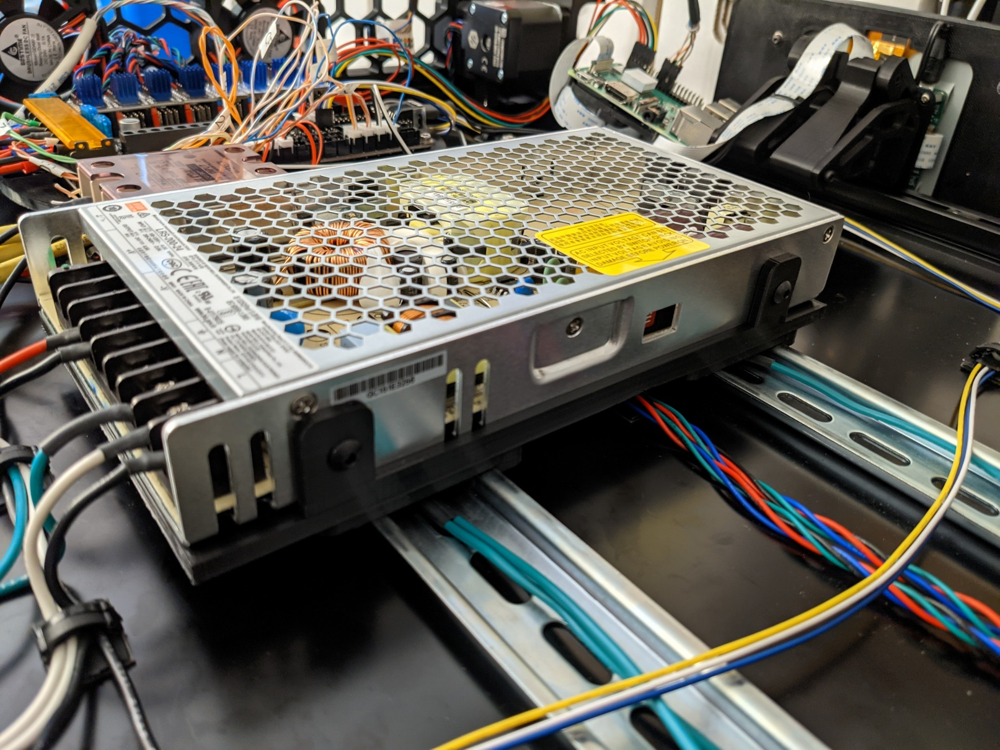
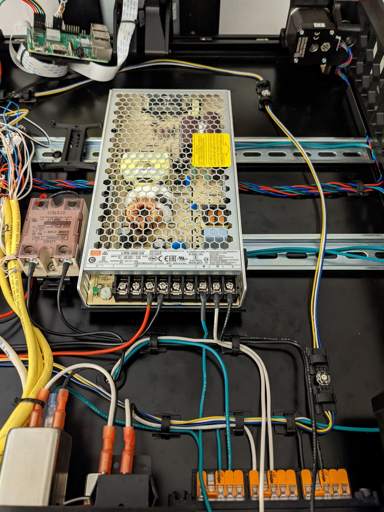

LRS-200-24 PSU Dual DIN Rail Mount
=========

This is a combo remix of [mmotley's](https://www.thingiverse.com/mmotley) [Meanwell LRS-350-12 mounting bracket](https://www.thingiverse.com/thing:4530986) and [walttriano's](https://github.com/walttriano) [V2_Octopus_Mount](https://github.com/walttriano/V2_Octopus_Mount). It enables the Meanwell LRS power supply to be mounted vertically across 2 DIN rails of varying distance apart.

## Installation:
**Parts:**

* 8 x M3 Heat Set Inserts
* 8 x M3 (SHCS)
* 4 x M4 (BHCS)

After installing the M3 heat set inserts on the flat/bottom side of the clips place them evenly spaced apart on the 2 DIN rails.

Place the mounting bracket on top of the clips aligning the slots with the heat sets. Adjust as needed and secure the bracket to the clips with M3 screws. Using the side mounting holes secure the PSU to the mounting bracket with M4 screws.

