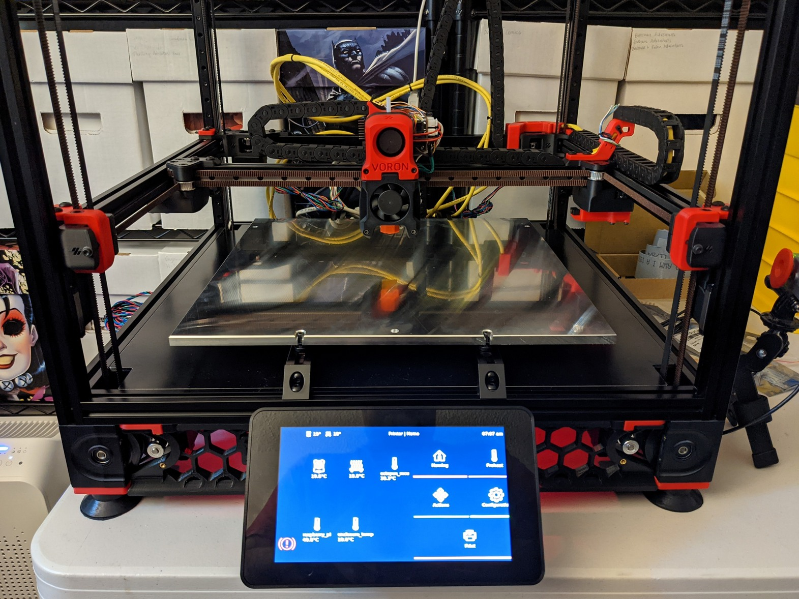
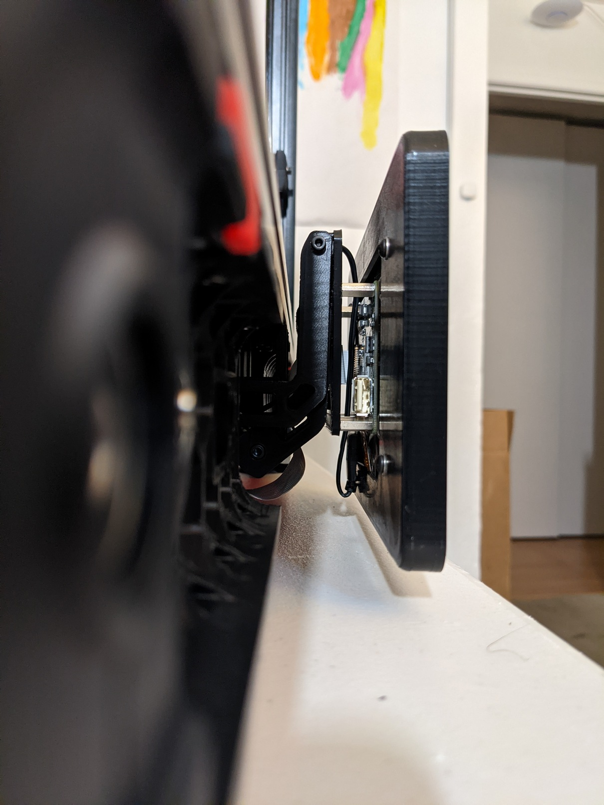
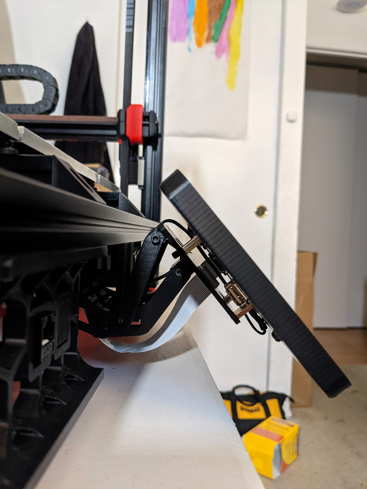
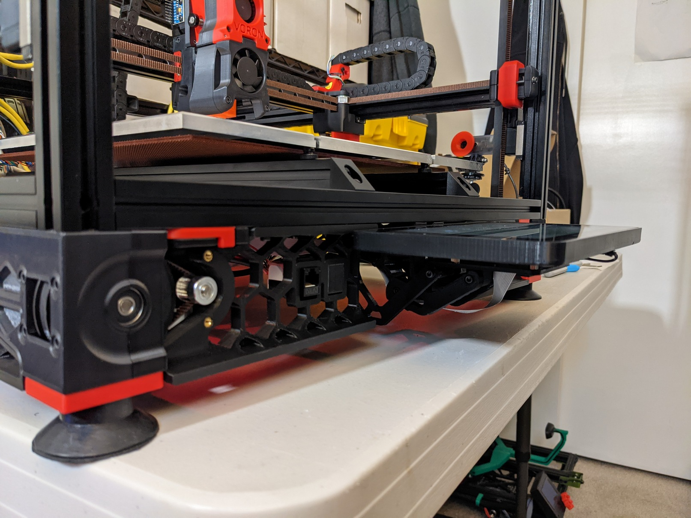
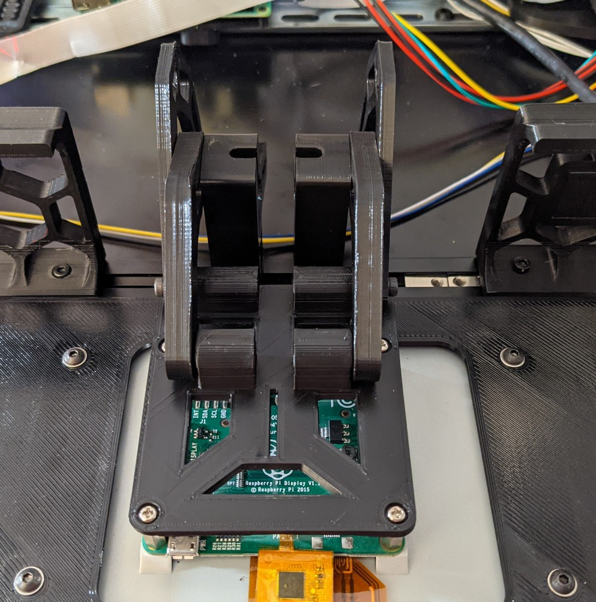
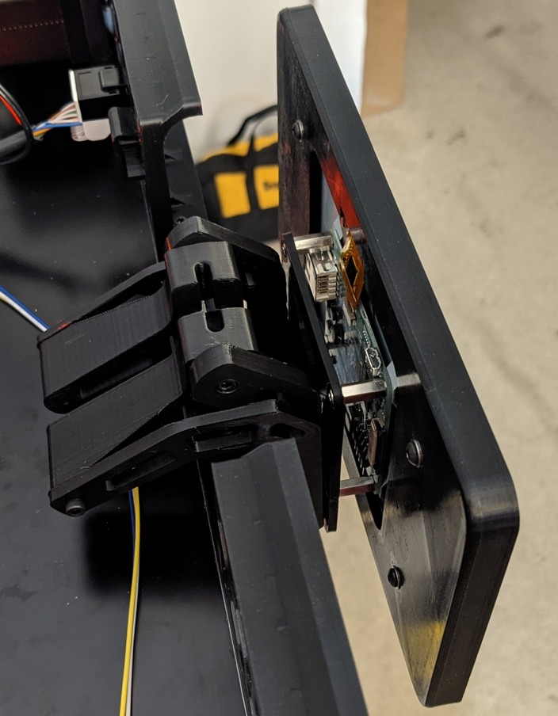
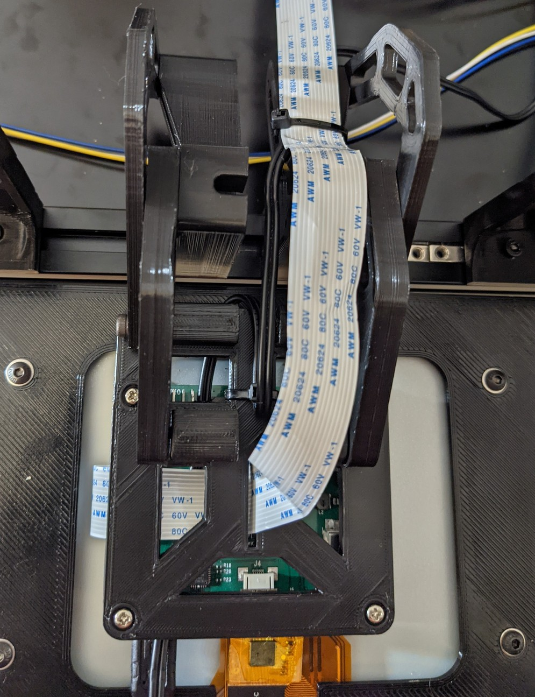
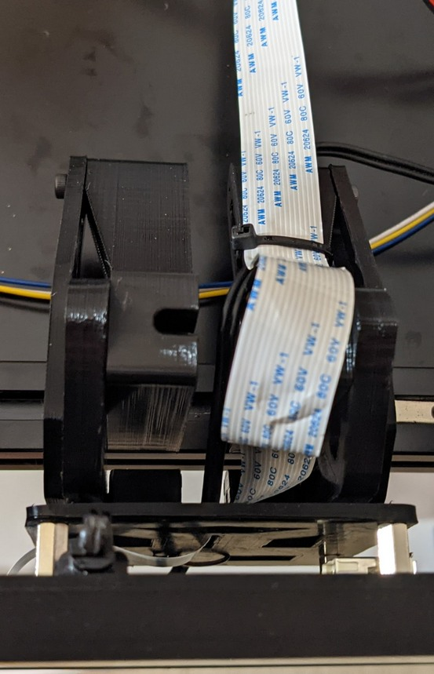

Articulating Raspberry Pi 7" Display Mount
=========

This is a combo remix of [driftology's](https://www.thingiverse.com/driftology) awesome articulating mount for the [Paneldue 7i V3](https://www.thingiverse.com/thing:4571677) and [th3fallen's](https://www.thingiverse.com/th3fallen) [PITFT50 mounting plate](https://www.thingiverse.com/thing:4881101). It enables the official Raspberry Pi 7" touchscreen display to be mounted in place of spec LCD to run [KlipperScreen](https://github.com/jordanruthe/KlipperScreen) while allowing the screen to tile out of the way to open and close the doors when needed.

## Installation:
**Parts:**
* [Raspberry Pi Touch Display](https://www.raspberrypi.org/products/raspberry-pi-touch-display/)
* Flex Ribbon Extension Cable *(length depending on distance from Pi)*
* 8 x M3x8 (SHCS)
* 2 x M4x8 (SHCS)
* 2 x M4 T/Hammer Nuts
* Zip ties

**Optional Display Case Back:**
* [luc_e](https://www.thingiverse.com/thing:1585924)
* [mjcopper](https://www.thingiverse.com/thing:4574770)

Assemble the parts in the following orientation making sure not to overtighten or strip the screw holes. The movement should be smooth, but tight enough to hold position.

Route the ribbon cable through cutout in the center of the mounting plate and up and over the pivot points. Use zip ties to secure the cables in place ensuring there is no binding in either position.

