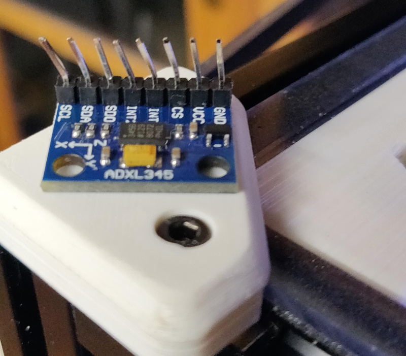
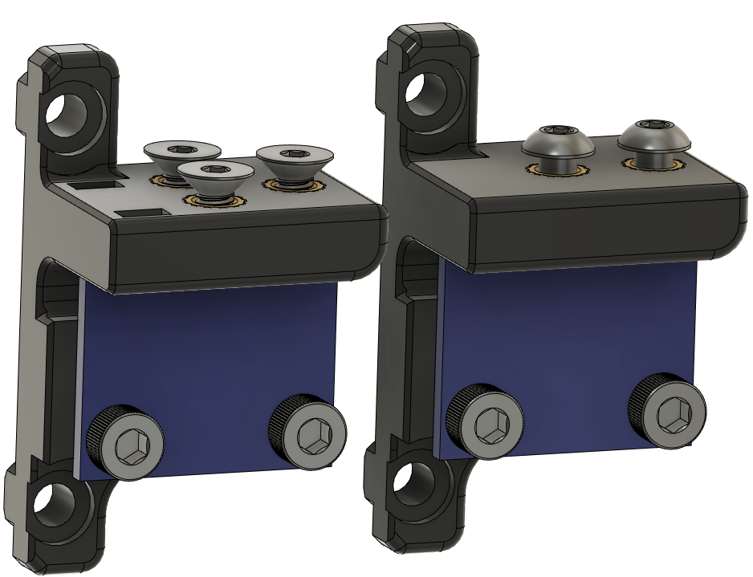
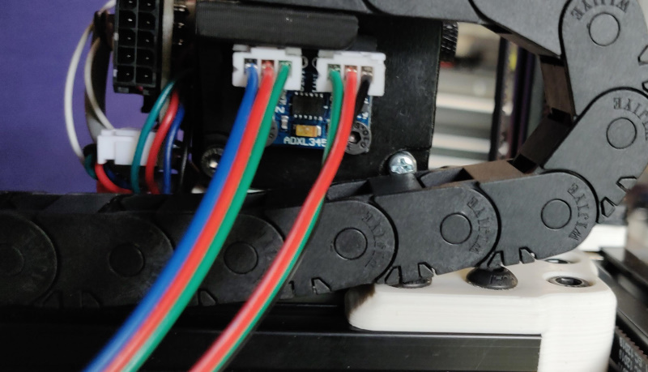
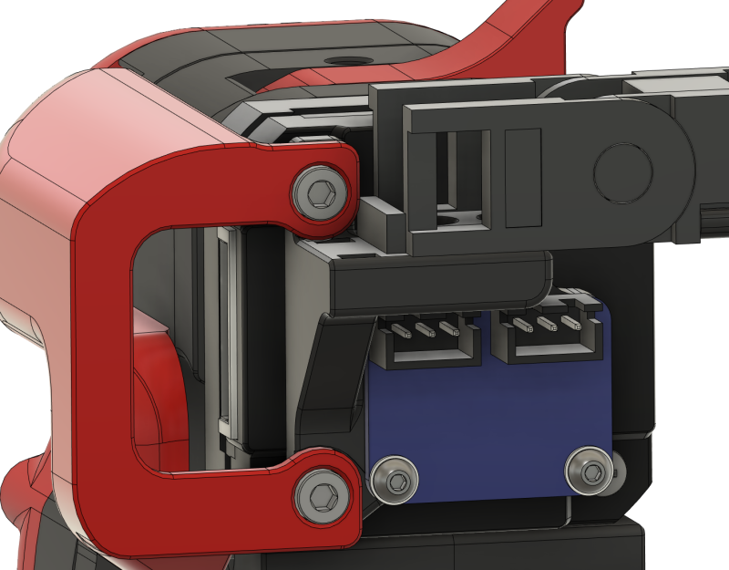

# ADXL345 GY-291/Adafruit Cable chain anchor mount

**WARNING: Dupont connectors can foul with your z-chain when homing, solder wires directly or ensure you have clearance.**

This is a mod for mounting the ADXL permanently. It moves your drag chain up by 5.5mm on the motor.

From testing this mount eliminates the Z component when measuring the Y resonance.

Check for clearance at the limits of movement

Clearance cad check for Adafruit board.

## Hardware
- DO NOT USE dupont on the ADXL boards, ensure you have clearance when homing using JST XH connectors or solder wires directly

### ADXL345 GY-291 board (21mm by 16mm)
- ADXL345 GY-291 board (21mm by 16mm)
- M3x6 BHCS
- M3 nylon/Printed washer
- M3 Threaded Insert * 3 or 5 (IGUS or Generic)

### Adafruit ADXL345 board (0.95in by 0.75in)
- Adafruit ADXL345 board (0.95in by 0.75in)
- M2.5x6 BHCS (threads into plastic)
- M2.5 nylon/printed washer
- M3 Threaded Insert * 2 or 3 (IGUS or Generic)

## Ideas that didn't work

- Dupont connectors on the ADXL board are too tall and foul the drag chain when homing.
- Attempting to use the three motor mounts doesn't work. Using the top hole would interfere with the drag chain as it's closer to the motor than the bolt. Using the bottom hole fouls the drag chain when X approaches 0.
- Using M3x8 bolts on the board moves the board closer to the back risking fouling with JST-XH connectors - would probably be ok if soldering wires directly.
- Attempting to not move the drag chain mounting up the motor doesn't give clearance as X approaches 0 for the board, it's too close to the bottom of the motor.
- Flipping the drag chain mount so it's level with the top of the motor instead of moving it up just makes the radius of the drag chain tighter and more awkward to fit.
- Trying to use threaded inserts for the Adafruit board would make the edges too thin

## Changes
2022-02-04 - Addressed issues with Adafruit mount identified by PineappleTuesday
2022-02-04 - Also fixed issue with IGUS end chain and mounting screw
2022-02-08 - Updated Adafruit with new cad - now 0.95in by 0.75in

discord:whistlinric