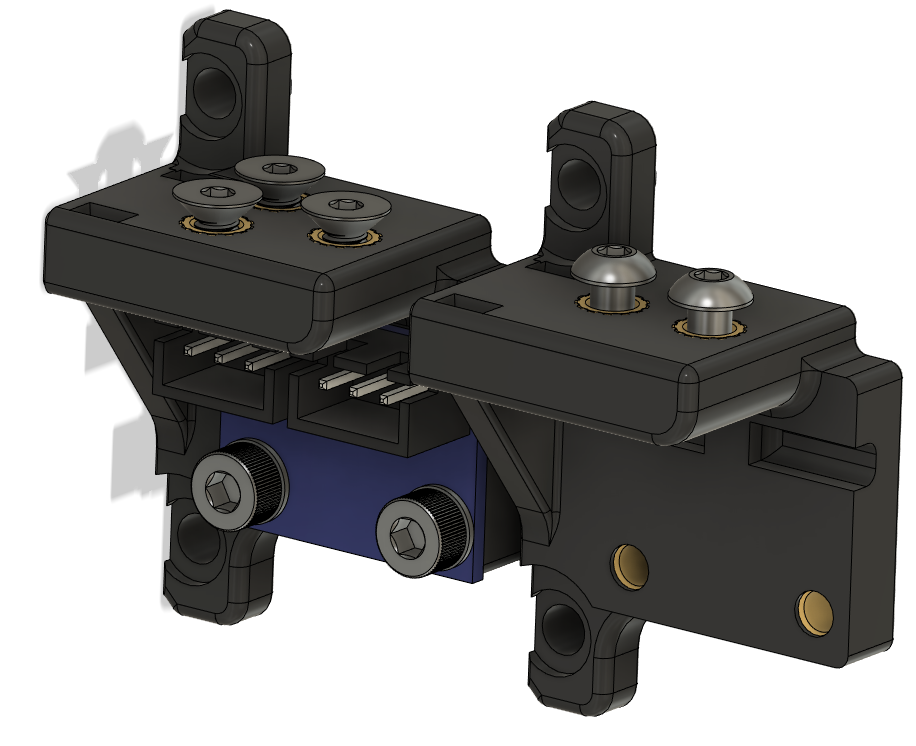

# WIP: ADXL345 GY-291 Cable mount

**WARNING: Dupont connectors can foul with your z-chain when homing, solder wires directly or ensure you have clearance.**

This is an in-development mod for mounting the ADXL permanently. It moves your drag chain up by 5.5mm on the motor.

A previous version had the ADXL mounted further right using a third corner of the motor but this fouls the x drag chain when X approaches 0.

## Hardware

- ADXL345 GY-291 board (21mm by 16mm)
- M3x6 BHCS
- M3 Nylon washer (optional)
- M3 Threaded Insert * 4 or 5 (IGUS or Generic)
- DO NOT USE dupont on the ADXL board, ensure you have clearance when homing using JST XH connectors or solder wires directly
