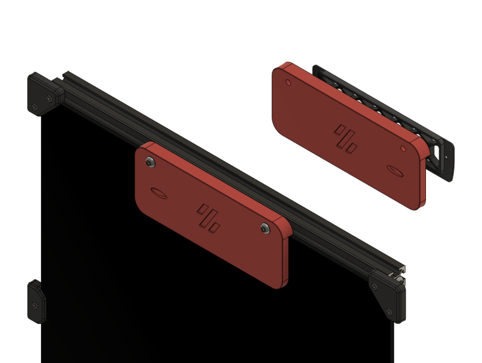
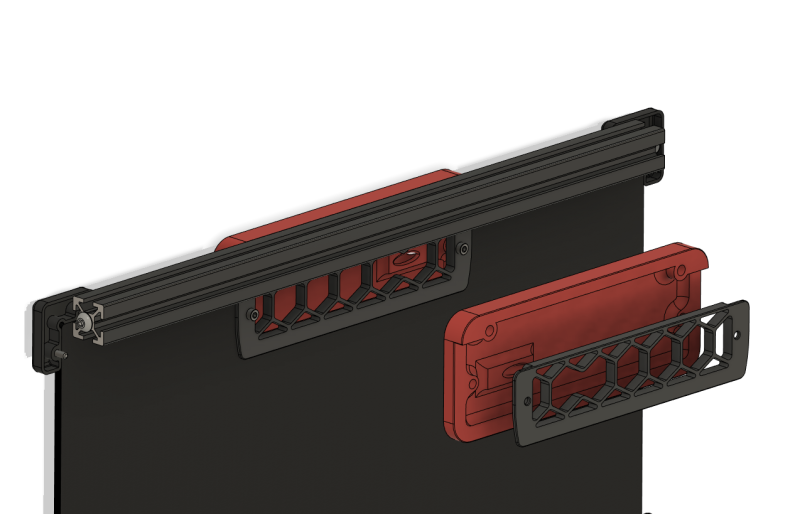
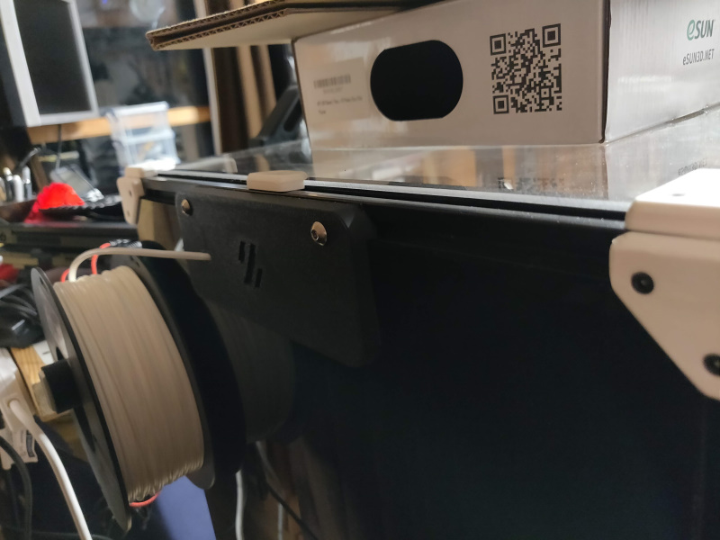
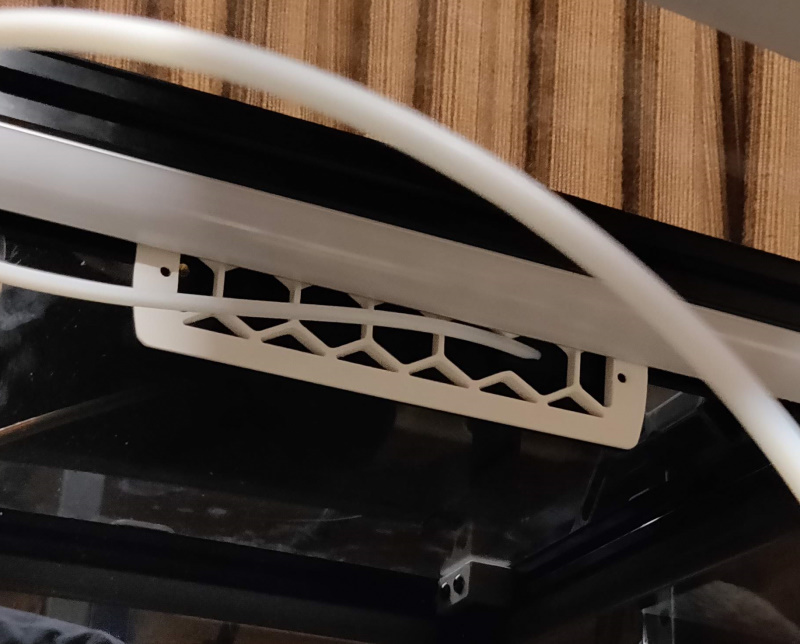

# Back plate blanking plate

If you choose not to use the exhaust - perhaps you're planning on fitting a nevermore instead. This is a blanking plate with integrated bowden tube route that goes in place of the exhaust filter housing.
It makes use of the existing grill with one strut removed (use the stl here or cut out a strut of a grill you already have printed) as I liked the look of it.

## Instructions
- Choose the appropriate blanking plate, the depth should be that of your back plate including the foam (distance from the flat of the extrusion to the flat of the back plate)
- Put foam on the edges of the blanking plate that contact the back plate and extrusion
- Cut out a strut from the exhaust grill or print a new one
- 2 x M5x16 (for the 5mm variant)
- 2 x heatset inserts into blanking plate
- Existing M5 T-Nut and M3x12 bolt from exhaust filter housing
- Ream the bowden path and push the tube through, it is a tight fit
- Thread the tube through the grill before attaching to your extruder, not that I would have done that, oh no
- Tighten it all into place

## Installed

Ignore the missing m3 screws holding the grill in place, it's because the led bar interferes.