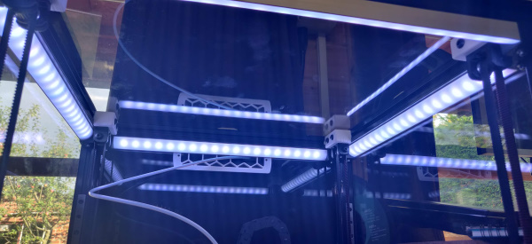
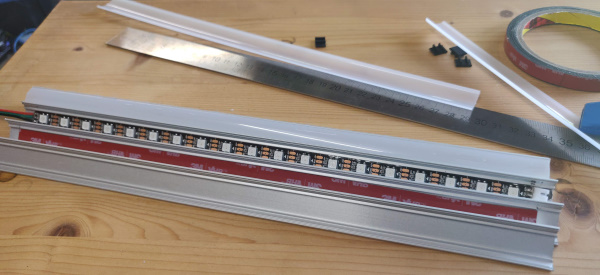
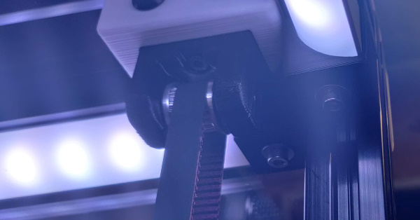
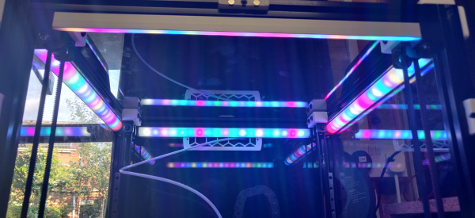

# Quarter round led mount with integrated cable run

An integrated led mount that sneaks the cables behind the z idlers.
This part is all you need to hold the led string in place and hide away those
cables.

## Hardware

- A single m3x25 bolt, m3 washer and t-nut
- JST-XH 3 way connectors and short cable runs from end to end (whatever connectors suits your LED strips best)
- LED strip - I used neopixels but you can use whatever
- 15.5mm quarter round LED extrusion with diffiser
- VHB tape if necessary

## Mounting

To get the data and power I ran a cable up from the electronics bay in the rear extrusion.
To hold the cable in place up the extrusion I used kapton tape as I thought using cable
clips could interfere with the gantry motion.

Fit LED strips into extrusion with VHB tape if required, having a short length of cable on
one end sufficient to reach through the corner mount to the next led strip in the chain, the
input end can be a JST-XH connector soldered directly to the strip I found. Do what works
for your LED string.

Start at one corner putting the connector from the electronics bay where it's needed and
fasten a corner or end into the extrusion using the m3x25, t-nut and washer.

Put the other corner up and run the cable through, putting the bolt in after making sure
not to crush it.

Attach to the next strip and put the strip in the corner mount _before_ fitting the second
bolt. This allows the cable more space to fold into the mount. Fit the bolt while holding
the extrusion up and continue around the printer fitting as many corners or ends as you need. 

