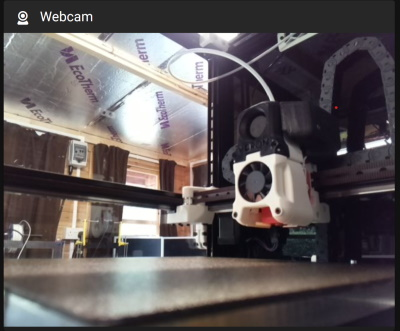
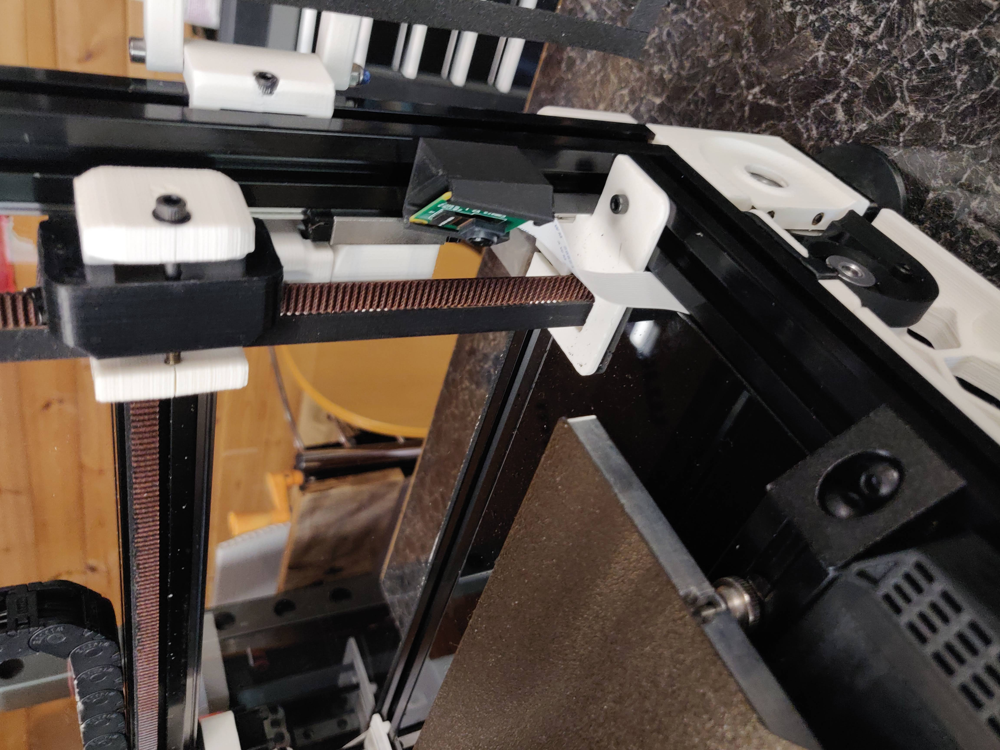

# Picam corner mount

About the only place I found to mount the picam with a view low down
of the bed. This was inspired by the [v0 design by xbst](../../xbst_/V0_Picam)

## Hardware

- A single m3x8 bolt and t-nut
- A suitable length of picam ribbon cable

