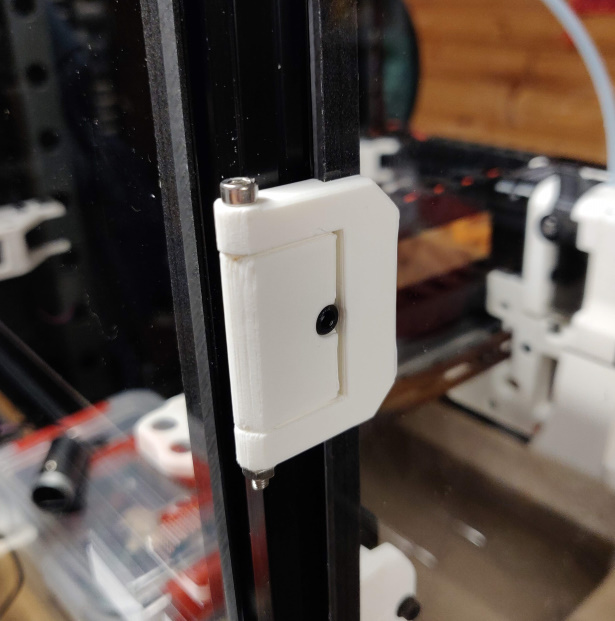
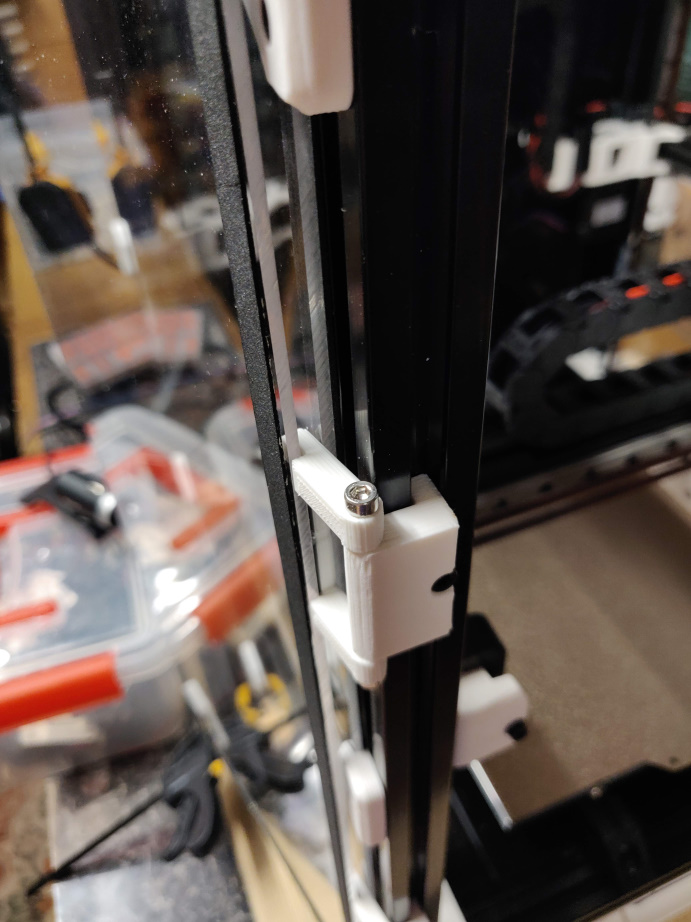

# Simple Hinge

A redesign of the front hinge requiring minimal (or no) extra hardware.

Differences:
- Allows opening of the front doors very nearly flat to the side panel
- Slightly larger gap between tabs to allow for the spring loaded style of t-nut
- Easier to print as there is no attempt to print the hinge pin itself
- Space for foam on front panel
- Also supports two color printing if you're feeling fancy

## Hardware

As the hinges are pin-style you can use a variety of pins to make it work

- M3x50 with optional nylock
or
- Length of 1.75mm filament
or
- M3x40 either threaded or with optional heat set insert

_Note: I've only printed an older version of the M3x50 variant_

