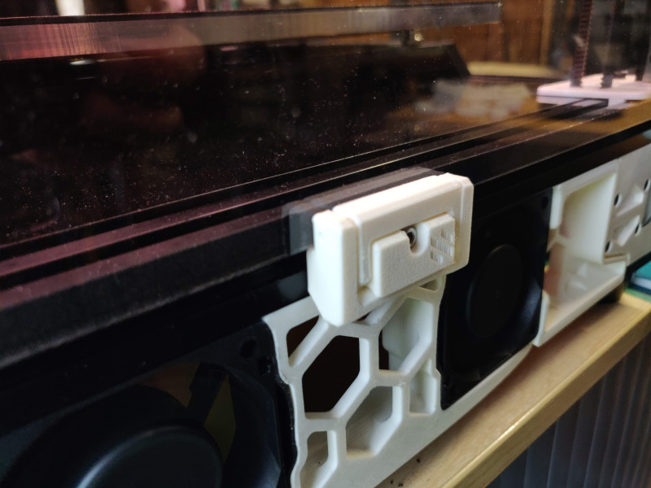
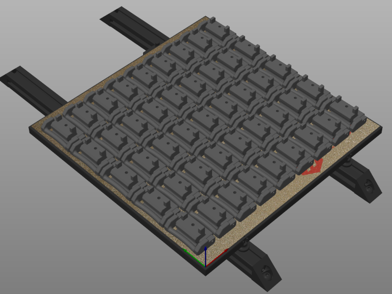
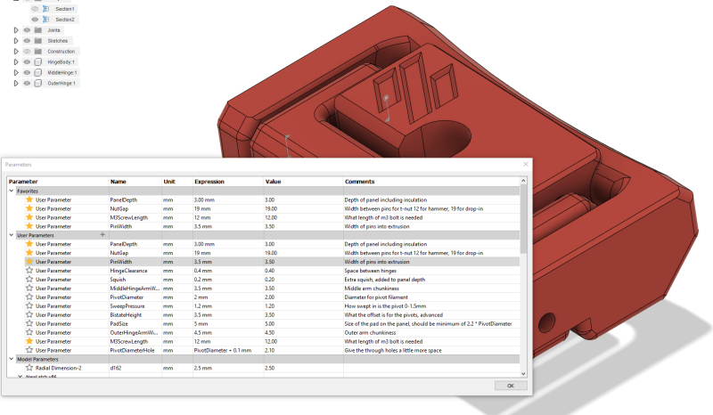
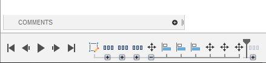

# Printable quick release latch for panels on 2020 extrusion

*I wouldn't say no to a like and a make on printables if you're that way inclined -
https://www.printables.com/model/172368-voron-24-filament-latch-or-any-2020-extrusion*

## Intro

This is originally inspired by a youtube video - [https://www.youtube.com/watch?v=6p7M18oPn3k](https://www.youtube.com/watch?v=6p7M18oPn3k)

Another user is creating cad and variants - [https://github.com/v6cl/My-Voron2.4-Customs/tree/main/Panel_Locker](https://github.com/v6cl/My-Voron2.4-Customs/tree/main/Panel_Locker)

## So why did you do it?

1. I wanted a variant with filament hinges
1. I found it didn't put quite enough pressure on the panel and my attempts to moodify the cad failed
1. Decided the best way to understand it was to design it
1. Wanted adjustable "pressure" and thought using a sweep on the latch was a nice solution making the most of the flex of ABS
1. Wanted everything as a parameter so I could tune it
1. Build plate density, a bonus of using a filament hinge is that the area used for each hinge is much smaller

45 instances on a 250 buildplate

## Hardware
- 3.0mm-5.5mm - m3x12
- 6.0mm-8.0mm - m3x16
- 8.5mm - m2x20

## The process

1. Cad attempt one failed, just modified surfaces to create a filament variant but adjustement beyond that failed
1. Cad attempt two failed, created a traced version copying the dimensions but again couldn't get a reliable adjustment
1. Cad attempt three of the cad sketch made as built was finally onto something, took until v45 before I had something that seemed to fulfil my requirements, then after thinking overnight revisited earlier designs and finally hit RC at v68 (18 actually printed)
1. Final design and thankfully discovered [sheeter](https://n3rdlab.com/downloads/sheeter/) which allows me to produce many stls based on parameters

## Assembly

1. Print parts (do test prints to ensure you're happy with the fit before going wild)
1. Assemble to correct orientation
1. Insert two short filament lengths connecting middle hinge to hinge body, one from each side
1. Insert one long filament length connecting middle hinge to outer hinge
1. The filaments are a tight-ish fit on the hinge arms but loose in the pivot intentionally
1. Connect to frame using with hammer nut or spring loaded nut with either m3x12 or mx16 depending on size of hinge printed

## Parameters

To make your own custom hinges you can modify the parameters in the cad - via Modify -> Change Parameters. Removing the logo just requires
you to supress the logo extrusion (last extrusion in the first group).

Changing these parameters to extremes may either not work or require fixups of chamfers and fillets, or even the primary sketch.

Once done, adjust the build plate view (use top view to ensure clearance) and save the file as mesh.

## Changes
2022-02-11: Added detent from devincody
2022-07-29: Reworked sketch to resolve in Fusion 360, re-exported fixing some incorrect sizes

discord:whistlinric