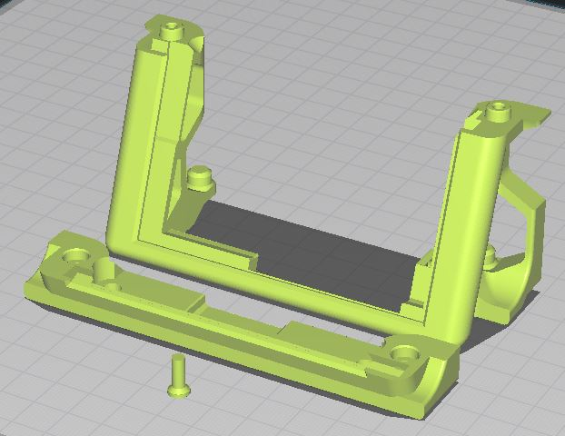

# 4-inch Touchscreen for OctoDash - Voron 2.4

## OctoDash

[OctoDash](https://unchartedbull.github.io/OctoDash/index.html) is a very cool dashboard / touchscreen UI for OctoPrint that you can download and install on your Raspberry Pi. It is recommended to configure your Pi with auto-login to desktop and auto-launch the OctoDash app at startup.

## Touchscreen and Cables

Octodash will work with almost any display attached to the Pi but I found this really nice [4-inch IPS touchscreen on AliExpress](https://www.aliexpress.com/item/4000329175443.html) that is perfectly suited - so I built a mount to integrate it into the V2.4 skirt as a drop-in replacement for the stock front panel. As such it should work on any size V2.4 (250/300/350) with the stock left- and right- front skirt pieces.

When buying this screen I recommend you choose the "4-inch IPS screen for 3B" even if you are using a Raspberry Pi model 4B, because the 3B variant comes with a full-size HDMI adapter which is easier to buy a cable for. 

For the HDMI cable to connect the screen to your Pi, if you have a Pi 4B you will need a Micro HDMI Male to Full size HDMI Female, 20-30cm long. These should be readily available on Amazon or AliExpress or eBay. Pi 3B requires Full size HDMI Male to Full size HDMI Female 20-30cm long.

You will also need a 26-40-way ribbon cable with Male IDC connector on one end and Female on the other to connect the screen to your Pi - this cable provides power and connectivity for the touchscreen function. I bought mine on eBay but you can get away with a 26-26 or 40-40 if you cannot find a 26-40, or relatively easily make one yourself if you just buy the loose parts.

You will need to download and install the appropriate display driver from the location shown on the AliExpress page.

## Screen Brightness Control

The touchscreen comes with a button that you can press to cycle around the screen brightness levels (10%-100%). In theory you only need to do this once because the screen remembers your setting even after power loss. However the button is inaccessible when mounted in the Voron skirt, so I incorporated a way to mount a cheap and commonly available 6mmx6mmx4.3mm push button [like this one](https://www.aliexpress.com/item/1005001308376742) in the skirt. You can get these from Amazon, AliExpress, eBay, etc. for around 1 cent/pence each.

## Complete BOM

* Touchscreen
* HDMI cable
* GPIO cable
* (optional) Push-button for brightness adjustment
* Printed parts (see STL folder)
* 2 x M3x12mm bolts
* 2 x M5x10mm bolts (Button Head) and T-Nuts to attach to Voron
* Additional 2 x M5x10mm bolts (Button Head) for the base panel

## Printed parts

I have provided STL files for the main display mount, which prints in 2 parts and screws together, and a small button extension for the push-button switch.

Print the STL files in the orientation shown in the image below. 3 walls / 3 top / 3 bottom and 40% infill is sufficient. You should ideally enable support (**__touching bed only__**) for the largest part, so that it has a clean edge to attach to your bottom panel (if you have one).

## Assembly Instructions

1. Install the display drivers on your Pi. Test the screen and install and configure OctoDash
1. Print the STL files
1. Solder approx. 8cm wires from the push button to bridge the existing button on the screen PCB
1. Insert the printed button extension into the hole in the screen mount and then the push button in the space provided
1. Attach the HDMI adapter and ribbon cable to the screen. You may need to bend the pins that the ribbon cable attaches to slightly to adjust the angle it attaches at - especially if you have a bottom panel on your Voron
1. Slide the screen into the printed mount and screw the 2 halves together with the M3 bolts
1. Attach the completed part to the Voron with M5x10mm BHCS bolts
1. Connect the HDMI and Ribbon cables to your Pi
1. Enjoy!

## Gallery

#### Print Orientation:

