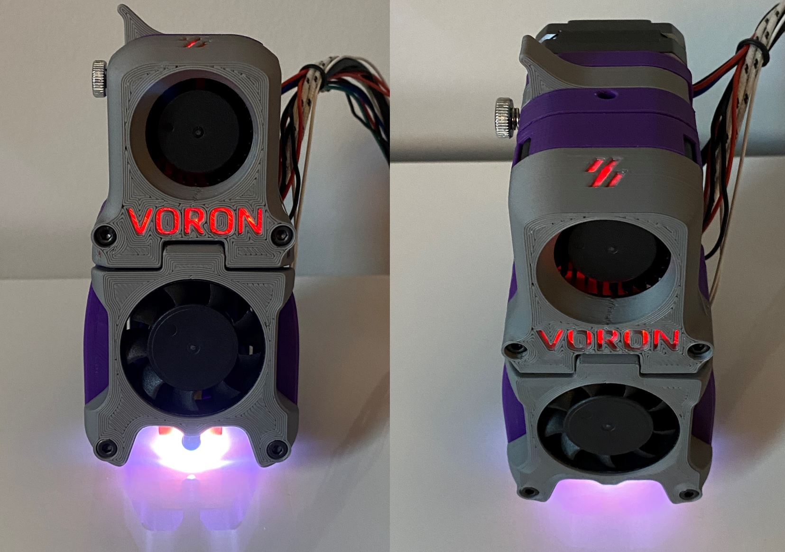
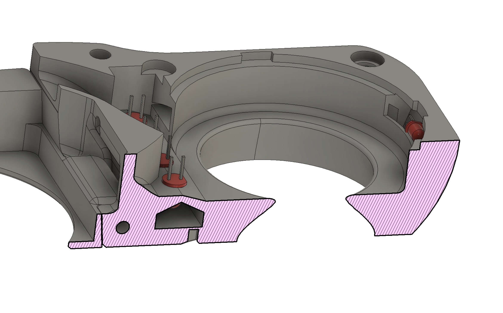
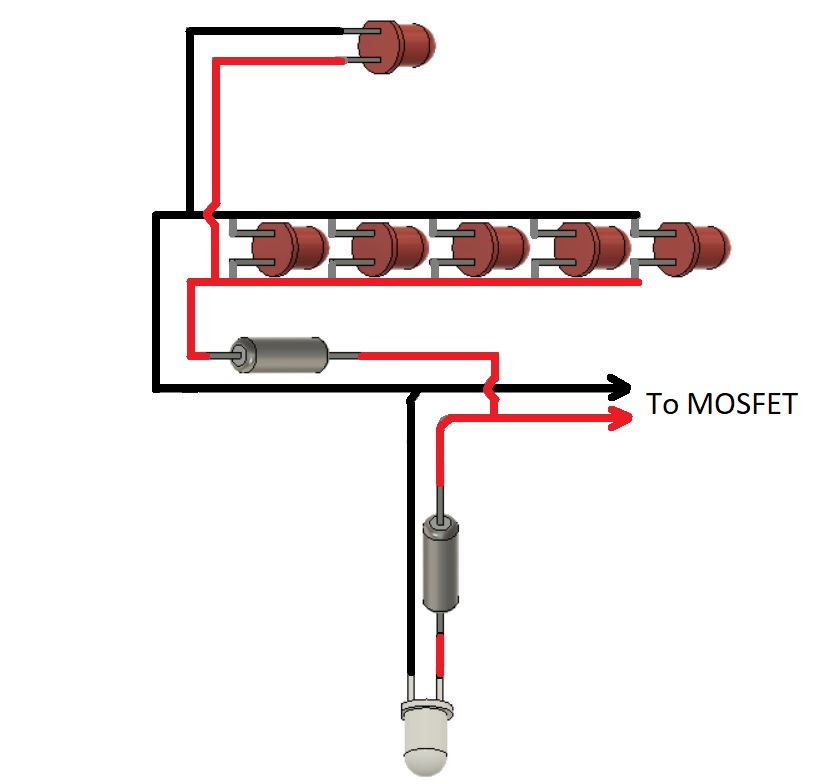
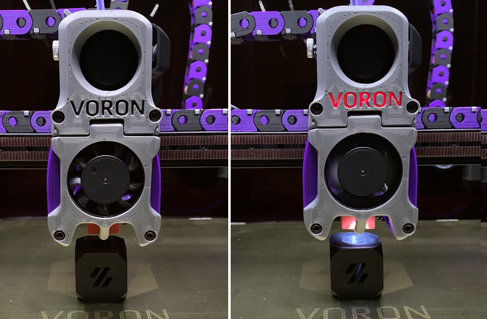

# Afterburner LED Lighting

This mod provides illumination for the Voron Logos on the Afterburner blower case and also a light for the toolhead nozzle and print surface.

If you just want the nozzle lighting but not the logo lighting (or vice versa) that's fine - you can do each without the other.

## BOM

You will need:
* 5 x 3mm round red LEDs
* 1 x 3x2mm rectangular red LED (or you vould just carefully file down a 3mm round LED to fit)
* 1 x 3mm round white LED
* resistors (exact values will depend on the LED type you use)

A good explanation of how LEDs work and how to calculate resistor values [can be found here](https://www.ledsupply.com/blog/how-does-a-5mm-led-work)

I also provided the STL for a version which takes a 5mm white LED rather than 3mm, but in my experience the 3mm LEDs have the same brightness as the 5mm ones, so I would recommend sticking with the 3mm version if you can.

## Instructions

1. Print the STL files
1. Check the datasheet for your LEDs to determine their forward voltage and current draw requirements
1. Choose appropriate resistor values for 24V supply voltage based on the schematic below
1. Wire the LEDs and resistors per the schematic below
  * All 6 red LEDs are wired in parallel with each other, with a resistor in series
  * The white LED has its own separate resistor in series
1. Connect to a spare mosfet output on one of your SKR boards
1. Apply the following Klipper configuration (or develop your own if you prefer different functionality)

> [heater_fan toolhead_leds] # This configuration turns on the LEDs whenever the hotend is ON or temperature sensor is > 40C
> pin: P2.7    # Adjust this if you are using a different mosfet
> heater: extruder
> heater_temp: 40
> shutdown_speed: 0

### CAD

### Final result - LEDs off vs on comparison:

