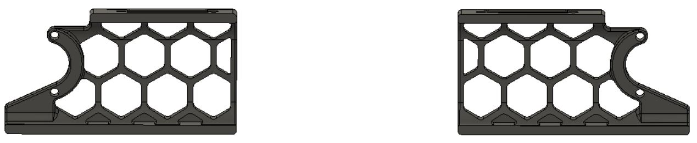

# Alternative Front/Rear Skirts - Voron 2.4

## Purpose

Some people have wanted to run their Vorons "headless" - i.e. with no attached screen. The "blank" midsection skirt presented here is used to fill in the gap where the screen would usually go. It could also be used at the rear of the Voron 2.4 if someone wanted to not have the power-inlet in the center of the rear skirt.

As a bonus, I adjusted the left and right skirt pieces to delete the wall section that would otherwise chop one of the hexagons in half on each side.

These left and right skirt pieces also go well with my "4-inch Touchscreen for OctoDash" mod, as the hexagons line up nicely to make it aesthetically pleasing.

## STL files can be found in the STL folder above:

## Original skirts for comparison:

