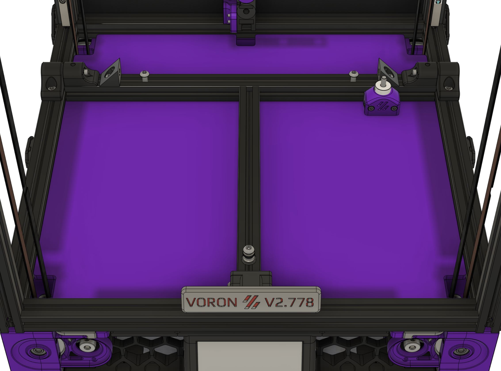
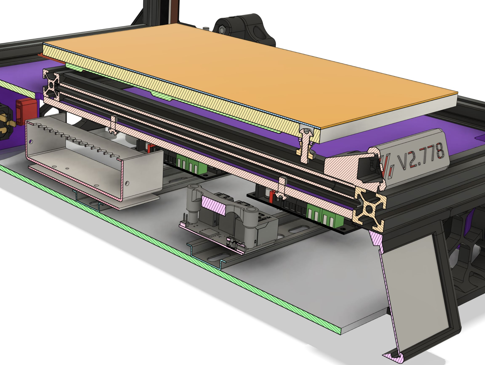

# Voron V2.4 Lift-up Print Bed with 3-Point Mount

Before even starting my Voron V2.4 build I had decided that I ***really*** didn't like the idea of having to turn the whole machine upside down to access the electronics. I knew that others had also had that thought and had come up with their own solutions, such as mounting all the electronics at the top of the chassis, or putting a car-hood style hinge system with gas lift under the print bed. At the same time I was also pondering the page in the V2.4 assembly manual that showed the four mounting bolts attaching the print bed to the extrusions with a comment that *"Some people have more luck doing a 3 point bed mount"*, and a diagram simply showing the omission of one of the four bolts. And then when I saw all the *Taco* jokes on Discord after people had fully tightened even just three, never mind all four bolts, my solution became immediately crystalized.

## Goals

I decided my solution should achieve the following:

* Allow easy access to the electronics bay
* Securely and symmetrically support the print surface at three points (not four) 
* Eliminate any possibility of bed-warping (Taco effect) due to constrained expansion of the heated print bed
* Maximize Z-height by lowering the print bed slightly
* Not compromise any stability of the print bed, nor the calibration of the Z-endstop
* Not require any non-standard Voron parts or complicated fabrication

## My Solution

I devised a T-bar shaped solution which could be made by simply cutting the existing two print bed extrusions shorter (cut 2mm from one and cut 110mm from the other) and mounting them to the main chassis with a hinge at each side. The hinge design sets these extrusions 14mm lower than usual and still leaves space for a 5mm thick acrylic sheet to be used as the deck panel. The acrylic sheet is in two sections - the rear section being fixed whilst the front section attaches to the hinged T-bar extrusions.

The print bed (8mm aluminum sheet) is attached to the T-bar extrusion front-center using a single M5 bolt - this bolt being fully tightened. Two additional bolts are tightly attached to the rear-left and rear-right of the T-bar protruding upwards and the print bed simply rests on them. A 2020 triangle corner section piece is attached to each side of the rear of the T-bar extrusion, located about 2mm further apart from each other than the width of the print bed (i.e. 302mm apart for a 300mm print bed.) Mounted in this way, the print bed is free to expand and contract by a small amount both laterally and longitudinally whilst remaining fully supported.

The Z-endstop needed to be redesigned slightly to make it taller, and be relocated to the side of the print bed. It attaches to the T-bar extrusion so that it moves in unison with the print bed and as such does not require any recalibration after the bed is lifted up and down.

The front of the T-bar is supported with a printed part that rests on the front extrusion. This is designed to act as a handle with which to raise and lower the bed. It incorporates a cavity into which a strip of LEDs can be installed to provide for illumination of a logo or badge which can be made with the Voron's serial number. In addition, you will notice in the CAD above that this handle also nicely disguises the fact that the center rail of the T-bar is offset by 5mm to the left to account for the fact that additional space is needed to the right of the bed for the Z-endstop.

### Electronics

The electronics are mounted to DIN rails as usual, although I did redesign most of the DIN rail brackets, changing the orientation of the SKRs and also making the brackets stronger and more secure than the stock ones. I have a separate folder detailing these changes in my GitHub.

The DIN rails are simply attached to the bottom panel (3mm acrylic sheet) using M5 bolts and nuts. 

There is a cutout at the front-center of the rear deck panel for the wiring for the bed heater, thermistor, Z-endstop and front lighting to pass through. These wires needed to be carefully zip-tied and/or heatshrinked so as to ensure they stay together and pass through the cutout rather than wandering astray and getting trapped in the hinge mechanism.

## Like It? Want To Build It Yourself?

As I stated above, one of the goals of this project was that it should not require any additional parts outside of the Voron BOM. This goal was achieved - the only items needed are a few extra M5 nuts and bolts which every Voron builder almost certainly already has spare. For example you will need 2 x M5x40mm or M5x35mm SHCS bolts for the hinges with an M5 washer between the moving parts. You will also need a new spacer on the bolt which attaches the print bed to the T-bar extrusion as the BOM M4 knurled nut is not big enough for an M5 bolt. You could simply use M5 washers for this but I recommend using either a oversized washers or perhaps a larger (e.g. M8 or M10) knurled nut.

I am providing STL files for the printed parts if you want to try to recreate this yourself. Hopefully everything should be self-explanatory from the images and descriptions I have provided on this page.

If you have any questions or would like me to add any further detail here please DM me on the Voron Discord. Whilst I am not glued to Discord all day every day, I'll try to reply to you within a reasonable timeframe.

## Additional Gallery Images

### Print Orientation

*NB: The Z-endstop STL includes a 0.4mm base layer to aid bed-adhesion, which you will need to remove with a sharp knife. This is instead of it needing a brim to print. If you don't think you need this layer then move it -0.4mm in the Z direction in your slicer before printing.*

### My Completed Build

