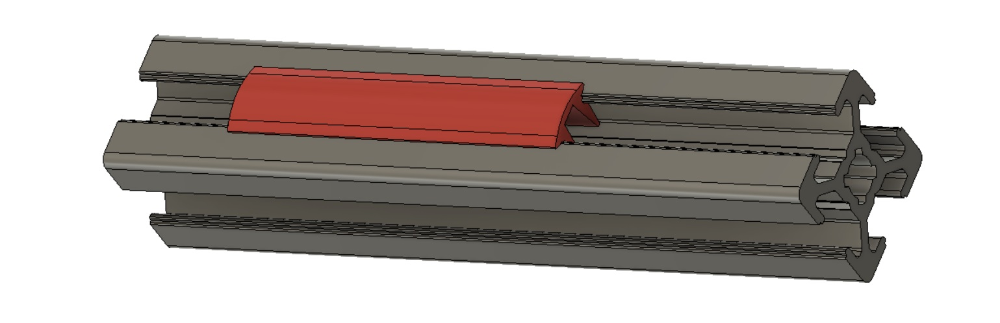

# Push-fit Extrusion Cap

This is a printable push-fit cover for 2020 extrusions which can be used to hide wires, or simply just to improve the aesthetic - if that's your thing.

I find this particularly useful if you want to mount lighting at the top of your printer but need to run the power wires from the bottom of the printer.

The model has been tested on both Misumi and (Euro) B-type 2020 extrusions. 

## Instructions

Print the STL file as follows:

* Load into your slicer - the part should be in vertical orientation
* Ensure you are hiding seams at the rear (or inside) the model - rotate if required
* Scale the Z-axis to whatever height (length) you want the printed part to be
* You will find it prints quicker with 3mm layer height rather than 2mm
* Number of walls/skins and infil is largely irrelevant
* Printing with a brim is recommended for improved bed-adhesion
* Printing multiple copies at the same time is recommended to increase layer time. i.e. it will be faster to print 4 x 50mm lengths rather than 1 x 200mm length, and the print quality should be higher too

## Notes

It is designed to be a tight fit and may be hard to remove once inserted, although it should be relatively easy to slide along the length of the extrusion once inserted.
If it's *too* tight for your use case, you can soften it up by flexing it manually before insertion, or sliding it through a spare piece of 2020 extrusion
Take care not to trap wires when inserting!
