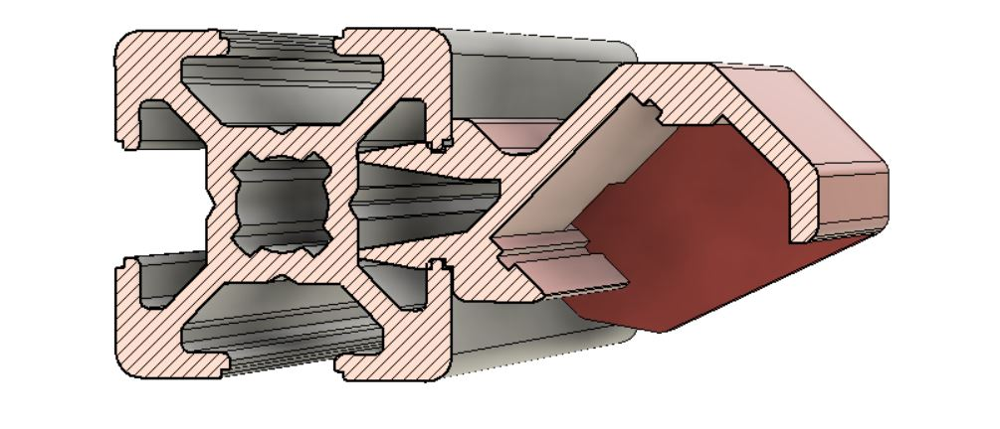

# Push-fit LED strip lighting holder for 2020 extrusion

This lighting solution is designed to mount standard 10mm wide LED strips (e.g. SMD5050) with a simple push-fit into horizontal or vertical 2020 extrusions.

Its main features include:

* LED strip mounted at 45 degrees to illuminate downwards/outwards
* Shroud to stop stray light shining outwards/upwards, which otherwise can be quite dazzling
* Prints in 2 parts which messh together for a seamless look with no light leakage
* Integrated wire routing through 2020 extrusion (see my push-fit extrusion cap mod to completely hide the wires)
* Also supports standard clip-in diffuser designed for aluminium U profiles ([available from AliExpress](https://www.aliexpress.com/item/4001233527740.html) and many other places)

STL files for standard lengths you would want for Voron sizes are in the STL folder, including a special version for the Tiny-M

## Instructions

Choose the "L" and "R" STL files based on the length you need. E.g. a Voron 2.4 300x300 build (see CAD image below) will need the 300mm version, etc.

For a Tiny-M 150x150 build (see CAD image below) use standard 150mm length for the horizontal but for the verticals use one of each of the "Tiny-M" STL files - they are designed so you have clearance to slide them upwards without fouling the front idlers.

### Print the STL files as follows:

* Load into your slicer - the parts should be in vertical orientation
* Ensure you are hiding seams at the rear (or inside) the model - rotate the models if required
* Number of walls/skins and infil is largely irrelevant
* Printing with a brim is not necessary
* Printing multiple parts at the same time is recommended to increase layer time

### Installation:

1. Plan your wiring route, cut the LED strip to length and attach appropriate lengths of wire
1. Install the LED strip with its self-adhesive backing into either the L or R printed part (not both) with wiring pushed through the hole at the rear
1. Insert both the L and R parts into the extrusion separately, then slide them together
1. Now attach the LED strip to the other printed part
1. If you have a diffuser, clip it in now
1. Use my push-fit extrusion caps to fully hide the wires

## Notes

The printed parts are designed to be a tight fit in the extrusion, although they should be relatively easy to slide along the length of the extrusion once inserted. If they are *too* tight for you, you can soften them up by flexing manually before insertion, or sliding through a spare piece of 2020 extrusion

Take care not to trap wires when inserting!

If you need to remove them, follow the instructions in reverse: Remove LED strip first, slide L and R parts apart, then remove from extrusion

## Pro-Tip

If you have 12V LED strips and want to power them from 24V (or even PWM'd 24V) wire half the strip in series with the other half

## Cross-section view

## Asssembly

## Installed in Voron 2.4

## Installed in Tiny-M

