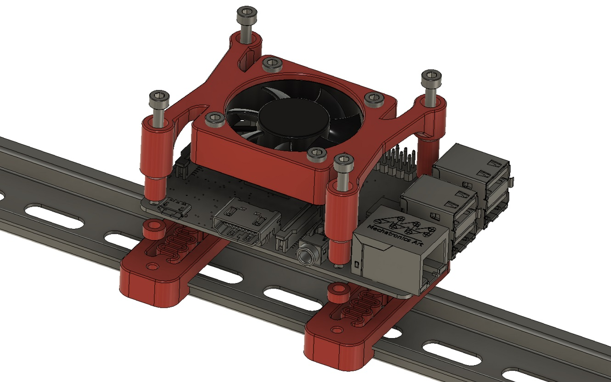

# Raspberry Pi mount incorporating cooling fan

This is my DIN rail mounting solution for the Raspberry Pi incorporating a 4010 (40mm x 10mm) cooling fan. Whilst having a fan is not essential, it will definitely reduce CPU temperatures, which could be helpful if the ambient temperature where your Voron lives is above average. Better to be safe than sorry I say.

This securely mounts the Pi to the DIN rail without compromising access to the power, HDMI, GPIO and CSI connectors. There is sufficient clearance for the fan when heatsinks are used on the Pi SOC and other ICs.

Suitable for both Pi 3B and 4B.

## BOM
You will need:

* Set of heatsinks for Raspberry Pi - easily/cheaply obtained on AliExpress ([Example](https://www.aliexpress.com/item/32828051034.html)), Amazon or eBay
* 4010 (40mm x 10mm) 24V cooling fan. It would be OK to substitute a 12V or 5V fan if you can provide the correct voltage for it
* 4 x M3x16 SHCS and 4 x M3 nuts to attach the fan to the bracket
* 4 x M3x30 SHCS to attach the fan bracket to the DIN mount
* The printed parts

## Instructions
1. Ensure the fan wiring is of sufficient length and correctly terminated. Assuming you are using a 24V fan, I recommend using either a spare PWM output on the SKR to power it, or otherwise just undervolt it with a buck-converter. In my experience, about 50%-75% of full speed/voltage should be sufficient, and will make it run a lot quieter. Your mileage may vary  depending on your fan model so feel free to experiment.
1. Print the fan bracket, 2 x DIN clips and 4 x 3mm spacers
1. Attach heatsinks to the SOC, USB controller chip and WiFi controller chip. The RAM does not get hot so no need for a heatsink there
1. I discovered that the mounting holes on the Pi 3B and 4B are approx 2.75mm, which is clearly too tight to fit an M3 bolt through. You will need to widen them out with a 3mm drill bit. This is safe to do and can literally be done by hand with the drill bit - no electric power drill required. (Alternatively you could use M2.5x30mm bolts instead of M3x30mm if you have them)
1. If you are connecting a camera to the RPi using the CSI interface, attach the ribbon cable now
1. Attach the fan to the printed fan bracket with M3x16 SHCS bolts and M3 nuts. There is sufficient clearance for the nuts under the fan without them fouling the PCB or heatsinks
1. Align the printed fan bracket to the RPi PCB with the "skinnier" posts on the side with the GPIO pins, and the "fatter" posts on the side with the HDMI socket(s)
1. Insert M3x30 bolts through the printed fan bracket, then the RPi PCB, then the printed 3mm spacers, then screw into the printed DIN rail clips
1. Clip onto DIN rail
1. Cool!
