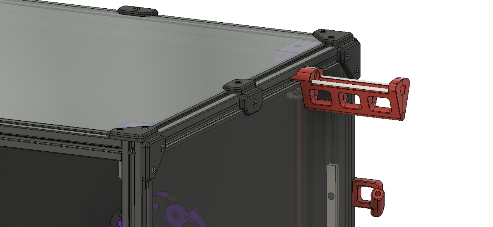
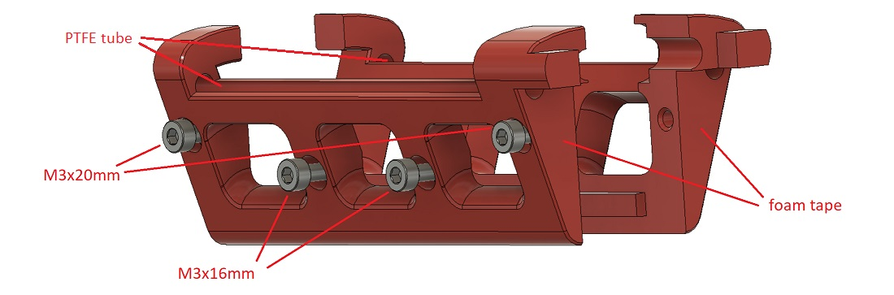

# Side-Mount Spoolholder

 This side-mounted spoolholder can be mounted on the side of a Voron V2, V1 or Tiny-M - i.e. any of the printers built on 2020 extrusions. It attaches with a single M5 bolt and relies on the acrylic side panel for additional support. It is very robust, featuring dual contact points with the spool. Also included is a bowden tube guide which points the tube at 45 degrees out towards the spool and 20 degrees out from the vertical.

An advantage is that your printer can now be pushed all the way back to the wall and you can change filament without going behind the printer.

Two versions are provided - one designed for the LHS and one for the RHS. They are exact mirror images of each other. If you have dual extruders you could mount one on each side!

 ## BOM

You will need:
* The printed parts - choose either the LHS or RHS set
* 2 x 90mm lengths of 4mm OD PTFE tube
* 1mm thick self-adhesive foam tape
* 2 x M3x16 and 2 x M3x20 to attach the front and rear sections of the spoolholder together
* 1 x M5x16 bolt and T-nut to attach the spoolholder to the printer
* 1 x M3x8 bolt and T-nut to attach the bowden tube guide

## Instructions

1. Print either the LHS or RHS set of parts
1. Attach front and rear parts to each other with the M3 bolts
1. Insert the lengths of PTFE tube and trim if necessary
1. Apply 1mm self-adhesive foam tape to the surface that touches the acrylic side panel
1. Attach to printer with M5 bolt
1. Attach bowden tube guide to printer and feed bowden tube through it

