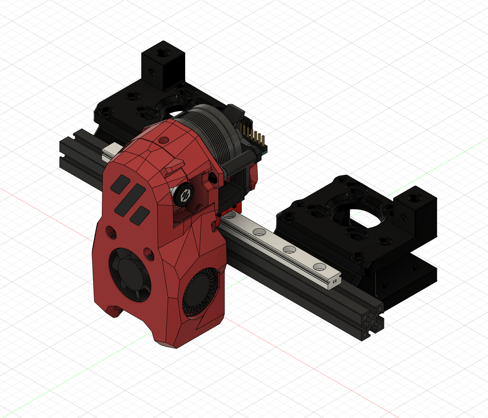
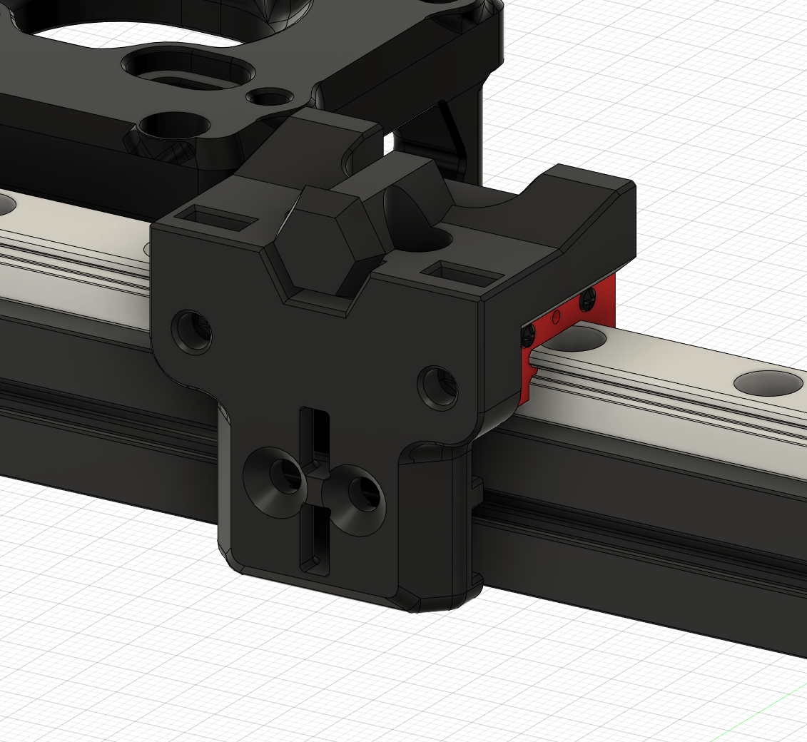
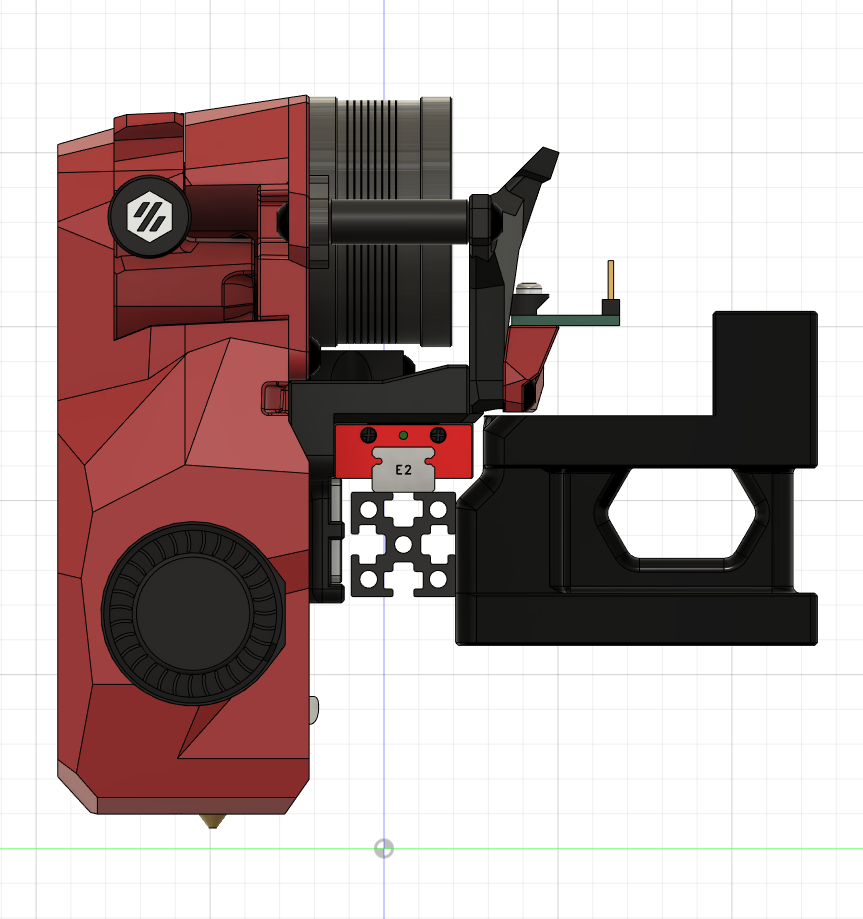

# MGN9C X Axis for V0.2

This mod replaces:

* The stock MGN7H rail on the V0.2 X axis with an MGN9C rail
* The stock AB drive frames with modified ones that have additional clearance for the MGN9C carriage

## Additional hardware

In addition to the hardware needed for the stock build:

* 1x MGN9C 150mm linear rail
* 10x M3x8 BHCS
* 6x M3 Nuts

## Instructions

Assembly is the mostly the same as the stock V0.2 X axis and AB frames. The MGN9C rail mounts to the X axis extrusion with 6x M3x8 BHCS screws and nuts, and the X carriage mounts to the MGN9C carriage with 4x M3x8 BHCS screws.

