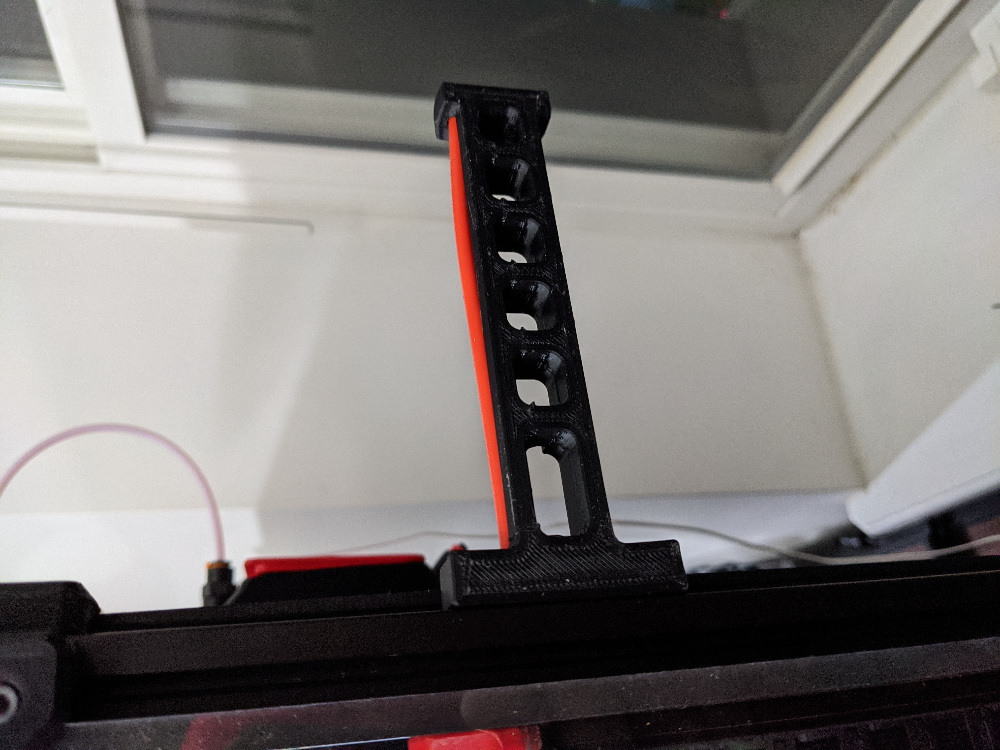

# Spool Holder for 5lb Spools

## Overview
This is a spool holder designed to fit a 5lb KVP spool.

## BOM
* 1x M5x16 BHCS.
* 1x M5 T-nut HNTAJ5-5.
* 2x PTFE Insert

## Printing instructions
The parts are easy to print, designed around 0.4mm line width, 0.2mm layer height and no need for supports.