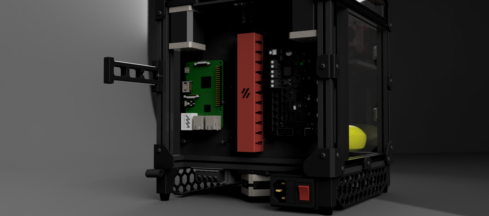
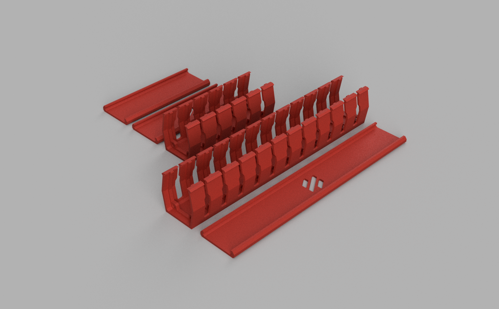

# Cable Management Duct

Little cable duct for hiding the cable. Can print with your desired color to match with your build. Integrated with zip tie mounts.

For the cable management manual, I refer to: [LDO here](http://docs.ldomotors.com/voron/voron01/wiring_guide_rev_a).

## Printed parts

There are two version:
- Standard size: if you have a large size printer I refer this.
- Small size: can print on Voron V0 bed size.

Print recommended:
- ABS
- No support needed

