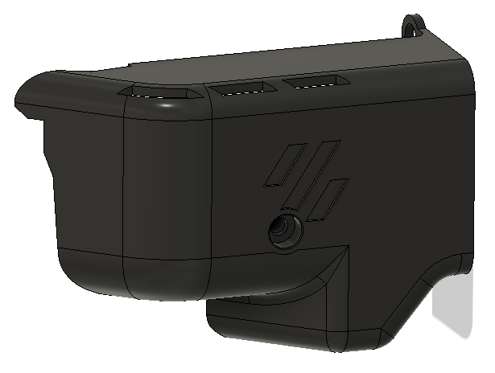
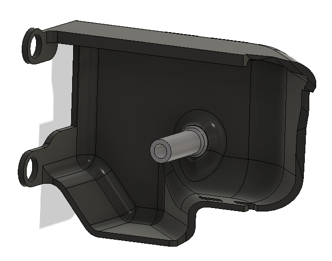

# LGX stealthburner cable cover

I was searching for connector cover that could fit my stealthburner LGX toolhead.
I could not find a cover that would fit my toolhead, so I redesigned [craxoor](https://github.com/craxoor/VoronMods/tree/master/PCB%20Cover) Afterburner PCB Cover. 

